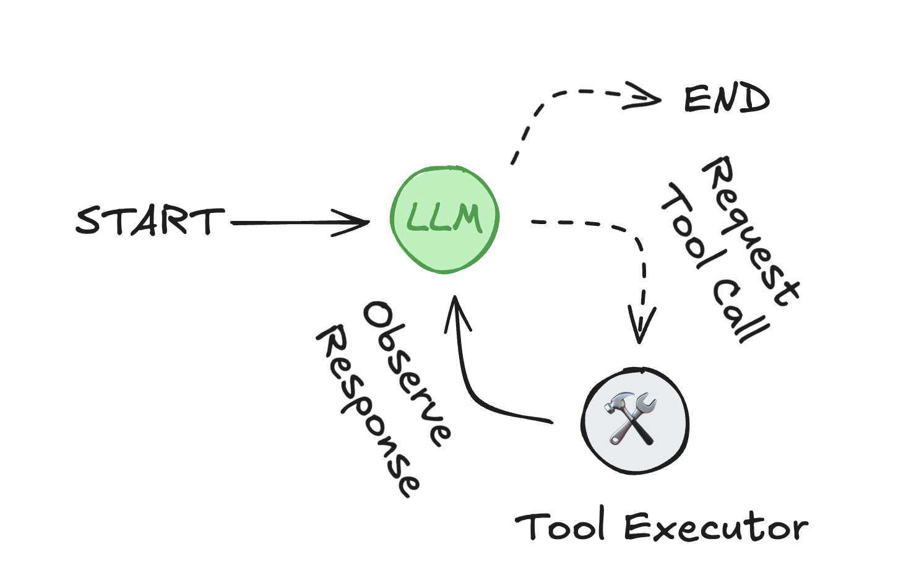

# 使用预制组件开发智能体

LangGraph既提供了底层原语，也提供了高级预制组件，用于构建基于智能体的应用。本节重点介绍这些即开即用的预制组件，它们旨在帮助您快速可靠地构建智能体系统——无需从头实现编排、记忆或人工反馈处理逻辑。

## 什么是智能体？

一个*智能体*包含三个组成部分：**大语言模型（LLM）**、可供调用的**工具集**，以及提供指令的**提示词**。

LLM在循环中运行。每次迭代时，它会选择一个工具进行调用，提供输入参数，接收结果（观察值），并利用该观察结果决定下一步行动。此循环持续进行，直到满足停止条件——通常发生在智能体已收集足够信息来响应用户请求时。

<figure markdown="1">
{: style="max-height:400px"}
<figcaption>智能体循环：LLM选择工具并利用其输出来完成用户请求</figcaption>
</figure>

## 核心特性

LangGraph包含构建健壮、生产级智能体系统所需的若干关键能力：

- [**记忆集成**](../how-tos/memory/add-memory.md)：原生支持*短期*（会话级）和*长期*（跨会话持久化）记忆，实现聊天机器人和助手的带状态行为。
- [**人工介入控制**](../concepts/human_in_the_loop.md)：执行过程可*无限期暂停*以等待人工反馈——不同于受限于实时交互的websocket方案。这允许在流程任意节点进行异步审批、修正或干预。
- [**流式支持**](../how-tos/streaming.md)：实时流式传输智能体状态、模型token、工具输出或组合流。
- [**部署工具链**](./deployment.md)：包含无基础设施依赖的部署工具。[**LangGraph平台**](https://langchain-ai.github.io/langgraph/concepts/langgraph_platform/)支持测试、调试和部署。
    - **[Studio](https://langchain-ai.github.io/langgraph/concepts/langgraph_studio/)**：可视化IDE，用于检查和调试工作流。
    - 支持多种生产环境[**部署选项**](https://langchain-ai.github.io/langgraph/concepts/deployment_options.md)。

## 高层级构建模块

LangGraph提供了一系列预制组件，这些组件实现了常见智能体行为和工作流。这些抽象构建在LangGraph框架之上，为生产部署提供快速通道，同时保持高级定制的灵活性。

使用LangGraph开发智能体，能让您专注于应用逻辑和行为设计，而不必构建和维护底层状态、记忆及人工反馈的基础设施。

## 包生态体系

高层级组件按功能划分为若干专用包：

| 包名                                      | 描述                                                                 | 安装命令                            |
|--------------------------------------------|-----------------------------------------------------------------------------|-----------------------------------------|
| `langgraph-prebuilt` (集成于`langgraph`) | 用于[**创建智能体**](./agents.md)的预制组件                     | `pip install -U langgraph langchain`    |
| `langgraph-supervisor`                     | 构建[**监督者**](./multi-agent.md#supervisor)智能体的工具     | `pip install -U langgraph-supervisor`   |
| `langgraph-swarm`                          | 构建[**集群**](./multi-agent.md#swarm)多智能体系统的工具 | `pip install -U langgraph-swarm`        |
| `langchain-mcp-adapters`                   | 对接[**MCP服务器**](./mcp.md)的工具和资源集成接口 | `pip install -U langchain-mcp-adapters` |
| `langmem`                                  | 智能体记忆管理：[**短期与长期**](../how-tos/memory/add-memory.md)        | `pip install -U langmem`                |
| `agentevals`                               | [**评估智能体性能**](./evals.md)的工具                   | `pip install -U agentevals`             |

## 可视化智能体图结构

使用以下工具可查看由[`create_react_agent`][langgraph.prebuilt.chat_agent_executor.create_react_agent]生成的图结构，并浏览对应代码大纲。该工具让您能探索智能体的基础设施组成，包括：

* [`tools`](../agents/tools.md)：智能体可调用的工具列表（函数、API或其他可调用对象）。
* [`pre_model_hook`](../how-tos/create-react-agent-manage-message-history.ipynb)：模型调用前执行的预处理函数，可用于消息压缩等操作。
* `post_model_hook`：模型调用后执行的后处理函数，可用于实现防护栏、人工介入流程等。
* [`response_format`](../agents/agents.md#6-configure-structured-output)：约束最终输出类型的数据结构，如`pydantic`的`BaseModel`。

  

    

      <h3 class="agent-section-title">特性</h3>
      <label><input type="checkbox" id="tools" checked> <code>tools</code></label>
      <label><input type="checkbox" id="pre_model_hook"> <code>pre_model_hook</code></label>
      <label><input type="checkbox" id="post_model_hook"> <code>post_model_hook</code></label>
      <label><input type="checkbox" id="response_format"> <code>response_format</code></label>
    

  

  

    <h3 class="agent-section-title">图结构</h3>
    
  

以下代码片段展示如何使用[`create_react_agent`][langgraph.prebuilt.chat_agent_executor.create_react_agent]创建上述智能体（及其底层图结构）：

  <pre><code id="agent-code" class="language-python"></code></pre>

