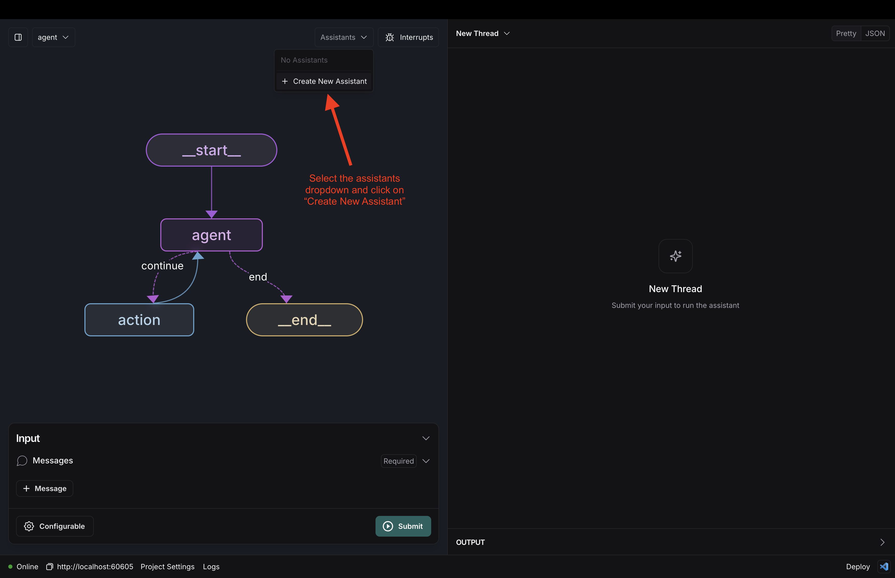
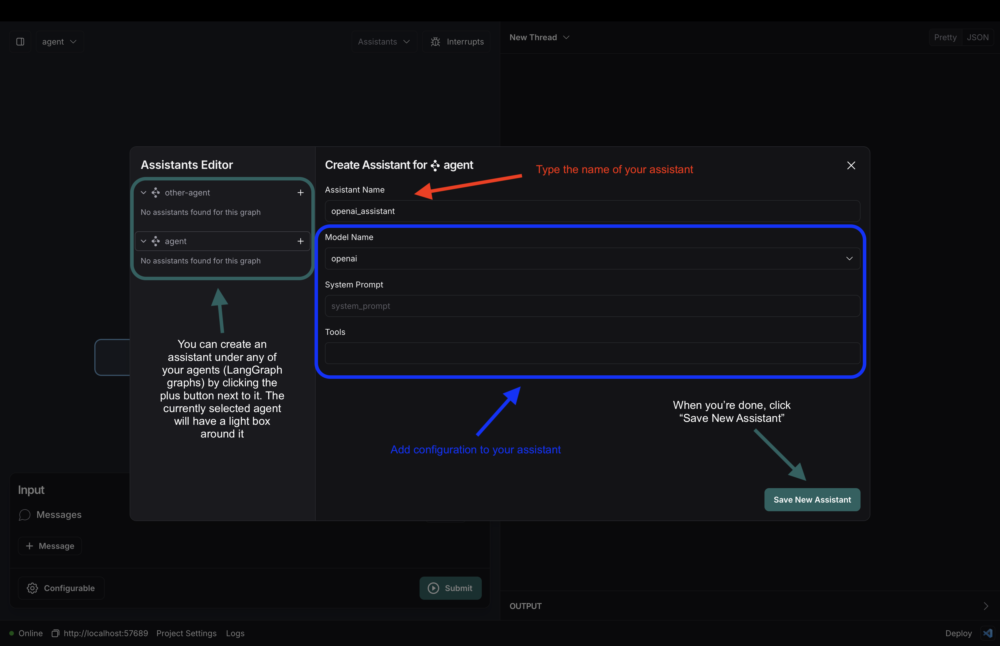
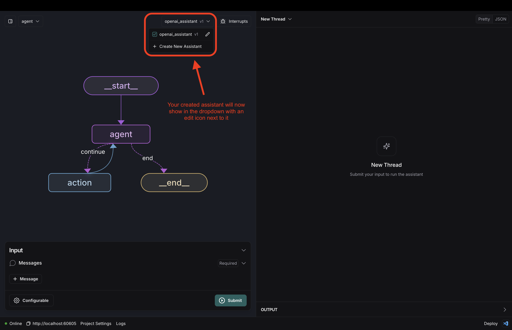
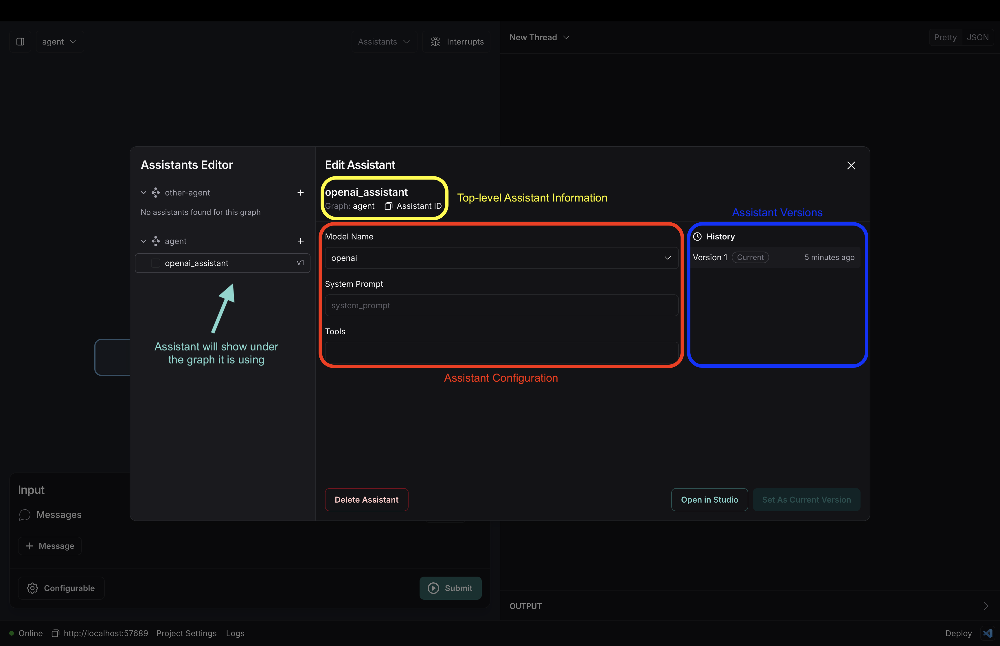
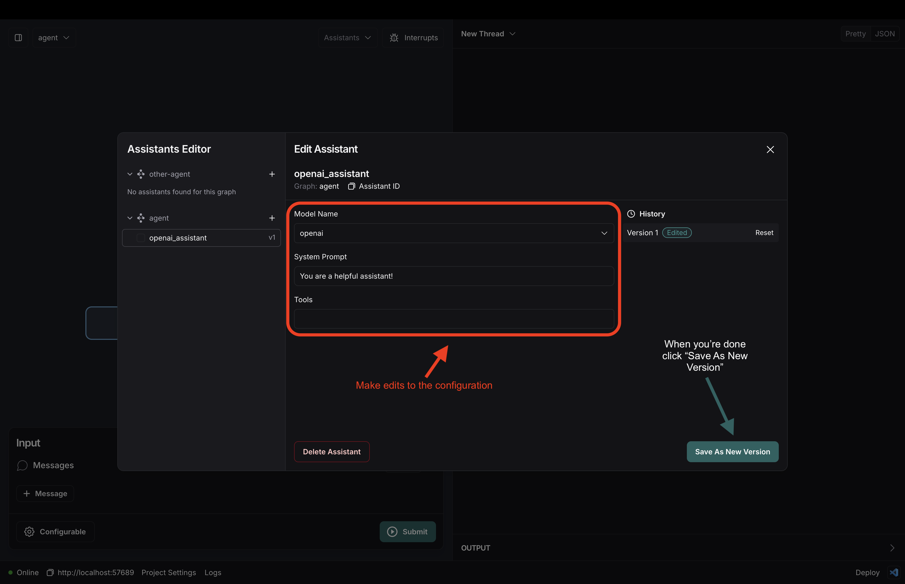
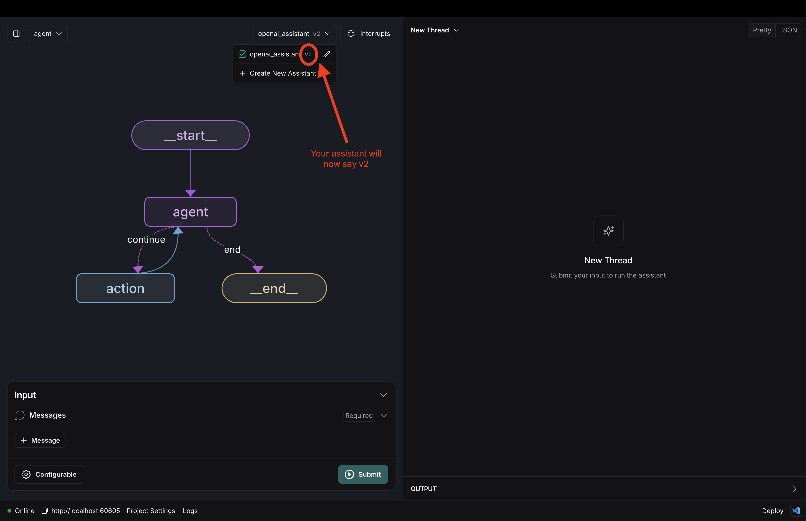
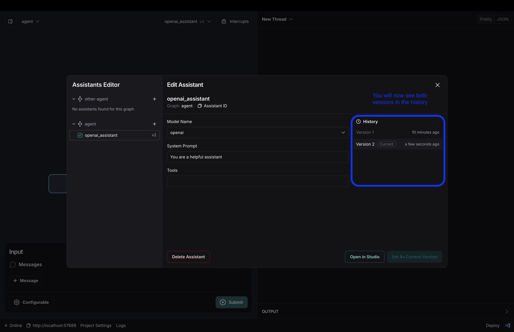
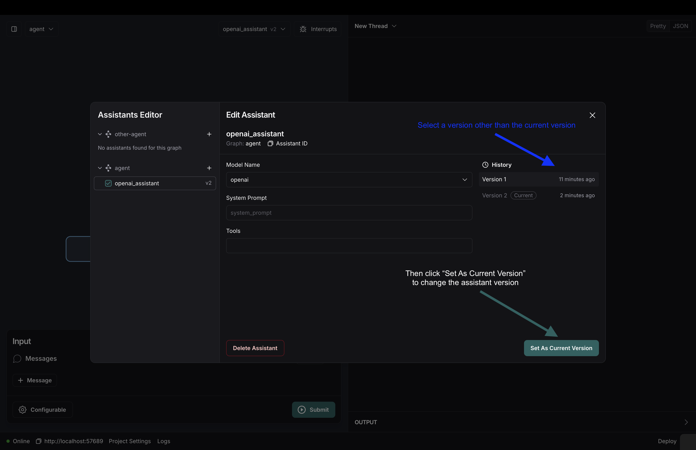

# 如何对助手进行版本控制

在本操作指南中，我们将逐步介绍如何创建和管理不同的助手版本。如果您还没有阅读过相关内容，可以先阅读[这篇](../../concepts/assistants.md#versioning-assistants)概念指南，以更好地理解助手版本控制的概念。本操作指南假设您有一个可配置的图，这意味着您已经定义了一个配置模式并将其传递给您的图，如下所示：

=== "Python"

    ```python
    class Config(BaseModel):
        model_name: Literal["anthropic", "openai"] = "anthropic"
        system_prompt: str

    agent = StateGraph(State, config_schema=Config)
    ```

=== "Javascript"

    ```js
    const ConfigAnnotation = Annotation.Root({
        modelName: Annotation<z.enum(["openai", "anthropic"])>({
            default: () => "anthropic",
        }),
        systemPrompt: Annotation<String>
    });

    // 其余代码

    const agent = new StateGraph(StateAnnotation, ConfigAnnotation);
    ```

## 设置

首先，让我们设置我们的客户端和线程。如果您使用的是Studio，只需打开名为“agent”的图。如果使用cURL，您只需复制您的部署URL和要使用的图的名称。

=== "Python"

    ```python
    from langgraph_sdk import get_client

    client = get_client(url=<DEPLOYMENT_URL>)
    # 使用部署时名为“agent”的图
    graph_name = "agent"
    ```

=== "Javascript"

    ```js
    import { Client } from "@langchain/langgraph-sdk";

    const client = new Client({ apiUrl: <DEPLOYMENT_URL> });
    // 使用部署时名为“agent”的图
    const graphName = "agent";
    ```

## 创建助手

在这个例子中，我们将通过修改图中使用的模型名称来创建一个助手。我们可以为此创建一个名为“openai_assistant”的新助手：

=== "Python"

    ```python
    openai_assistant = await client.assistants.create(graph_name, config={"configurable": {"model_name": "openai"}}, name="openai_assistant")
    ```

=== "Javascript"

    ```js
    const openaiAssistant = await client.assistants.create({graphId: graphName, config: { configurable: {"modelName": "openai"}}, name: "openaiAssistant"});
    ```

=== "CURL"

    ```bash
    curl --request POST \
    --url <DEPOLYMENT_URL>/assistants \
    --header 'Content-Type: application/json' \
    --data '{
    "graph_id": "agent",
    "config": {"model_name": "openai"},
    "name": "openai_assistant"
    }'
    ```

### 使用Studio

要使用Studio创建助手，请按照以下步骤操作：

1. 点击“创建新助手”按钮：

    

1. 使用创建助手窗格输入您希望创建的助手信息，然后点击创建：

    

1. 查看您的助手已创建并显示在Studio中

    

1. 点击所选助手旁边的编辑按钮以管理您创建的助手：

    

## 为您的助手创建新版本

现在假设我们想为我们的助手添加一个系统提示。我们可以通过使用`update`端点来实现这一点。请注意，您必须传递整个配置（以及元数据，如果您正在使用它）。`update`端点从头开始创建新版本，不依赖于之前输入的配置。在这种情况下，我们需要继续告诉助手使用“openai”作为模型。

=== "Python"

    ```python
    openai_assistant_v2 = await client.assistants.update(openai_assistant['assistant_id'], config={"configurable": {"model_name": "openai", "system_prompt": "You are a helpful assistant!"}})
    ```

=== "Javascript"

    ```js
    const openaiAssistantV2 = await client.assistants.update(openaiAssistant['assistant_id'], {config: { configurable: {"modelName": "openai", "systemPrompt": "You are a helpful assistant!"}}});
    ```

=== "CURL"

    ```bash
    curl --request PATCH \
    --url <DEPOLYMENT_URL>/assistants/<ASSISTANT_ID> \
    --header 'Content-Type: application/json' \
    --data '{
    "config": {"model_name": "openai", "system_prompt": "You are a helpful assistant!"}
    }'
    ```

### 使用Studio

1. 首先，点击`openai_assistant`旁边的编辑按钮。然后，添加一个系统提示并点击“保存新版本”：

    

1. 然后您可以在助手下拉列表中看到它被选中：

    

1. 您可以在助手的编辑窗格中查看所有版本历史记录：

    

## 将您的助手指向不同的版本

在创建了多个版本之后，我们可以通过使用SDK或Studio来更改助手指向的版本。在这种情况下，我们将把刚刚创建了两个版本的`openai_assistant`重置为指向第一个版本。当您创建一个新版本（通过使用`update`端点）时，助手会自动指向新创建的版本，因此按照上面的代码，我们的`openai_assistant`指向第二个版本。在这里，我们将更改它指向第一个版本：

=== "Python"

    ```python
    await client.assistants.set_latest(openai_assistant['assistant_id'], 1)
    ```

=== "Javascript"

    ```js
    await client.assistants.setLatest(openaiAssistant['assistant_id'], 1);
    ```

=== "CURL"

    ```bash
    curl --request POST \
    --url <DEPLOYMENT_URL>/assistants/<ASSISTANT_ID>/latest \
    --header 'Content-Type: application/json' \
    --data '{
    "version": 1
    }'
    ```

### 使用Studio

要更改版本，您只需点击助手的编辑窗格，选择要更改到的版本，然后点击“设置为当前版本”按钮



## 使用您的助手版本

无论您是不编写代码的业务用户，还是使用SDK的开发人员，助手版本控制都允许您在受控环境中快速测试不同的代理，从而轻松快速地进行迭代。您可以像使用普通助手一样使用任何助手版本，并且可以通过阅读[这些指南](https://langchain-ai.github.io/langgraph/cloud/how-tos/#streaming)或[这篇指南](https://langchain-ai.github.io/langgraph/cloud/how-tos/invoke_studio/)（如果您使用的是Studio）来了解更多关于如何从这些助手流式传输输出的信息。

!!! 警告 "删除助手"
    删除助手将删除其所有版本，因为它们都指向同一个助手ID。目前没有办法只删除单个版本，但通过将助手指向正确的版本，您可以跳过任何不希望使用的版本。