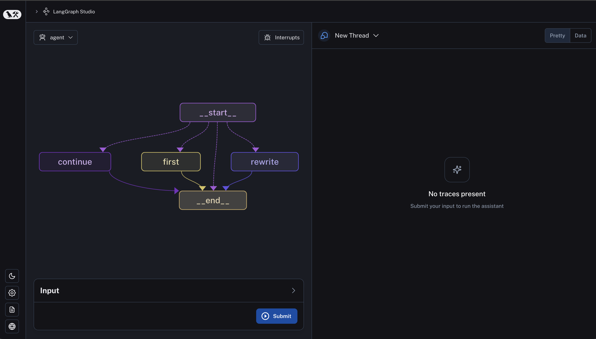

# LangGraph Studio 本地部署

!!! warning "浏览器兼容性"
    在 Safari 浏览器中无法查看本地 LangGraph 部署的 Studio 页面。请使用 Chrome 浏览器。

## 设置

确保您已正确设置应用程序，包括创建一个编译好的图、一个包含环境变量的 `.env` 文件，以及一个指向您的环境文件和编译图的 `langgraph.json` 配置文件。有关更详细的说明，请参见[此处](https://langchain-ai.github.io/langgraph/cloud/deployment/setup/)。

设置好应用程序后，进入包含 `langgraph.json` 文件的目录，并调用 `langgraph dev` 以启动 API 服务器，该服务器将处于监视模式，这意味着它会在代码更改时重新启动，非常适合本地测试。如果 API 服务器成功启动，您应该会看到类似以下的日志：

>    准备就绪！
> 
>    - API: [http://localhost:2024](http://localhost:2024/)
>     
>    - 文档: http://localhost:2024/docs
>     
>    - LangGraph Studio 网页界面: https://smith.langchain.com/studio/?baseUrl=http://127.0.0.1:2024

阅读此[参考](https://langchain-ai.github.io/langgraph/cloud/reference/cli/#up)以了解启动 API 服务器的所有选项。

## 访问 Studio

成功启动 API 服务器后，您可以通过访问以下 URL 来访问 Studio：`https://smith.langchain.com/studio/?baseUrl=http://127.0.0.1:2024`（如果使用 Safari，请参见上面的警告）。

如果一切正常，您应该会看到 Studio 界面，类似这样（左侧显示您的图）：

## 使用 Studio 进行测试

要了解如何使用 Studio 进行测试，请阅读 [LangGraph Studio 使用指南](https://langchain-ai.github.io/langgraph/cloud/how-tos/#langgraph-studio)。