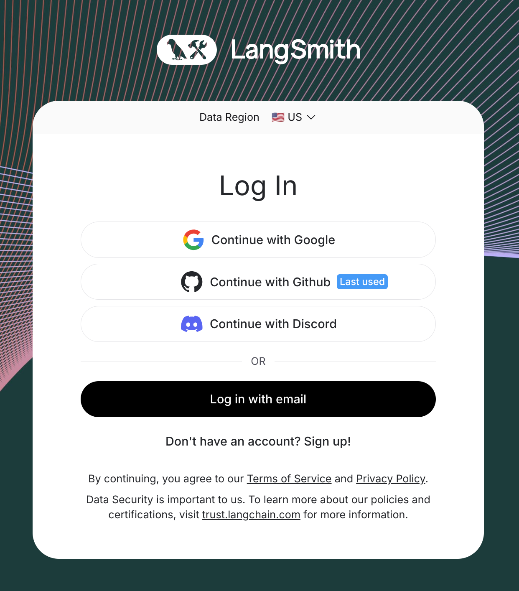
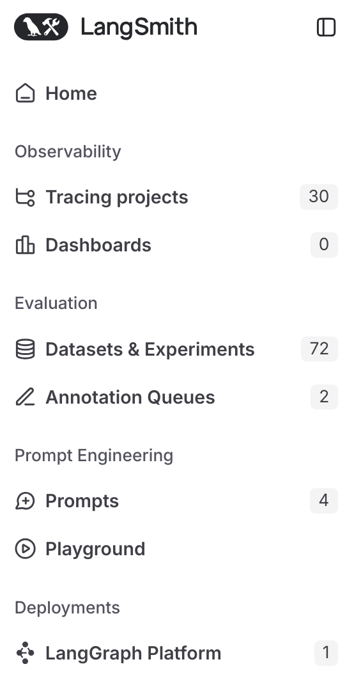
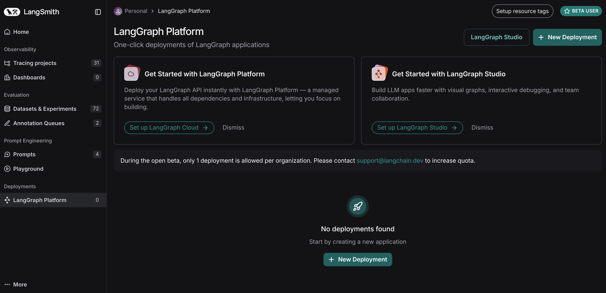
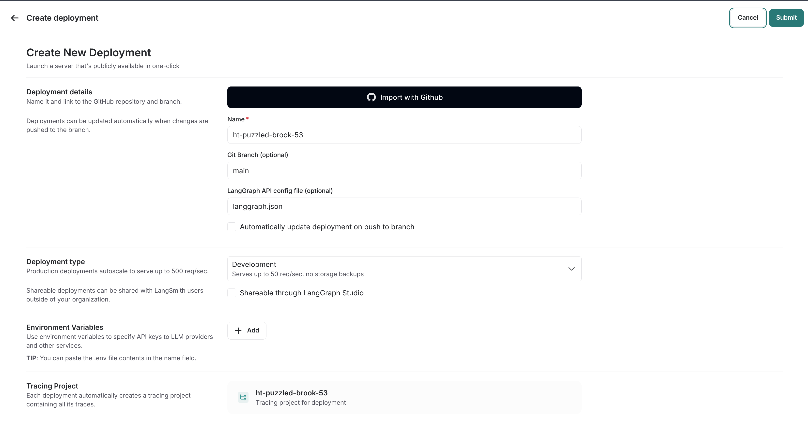
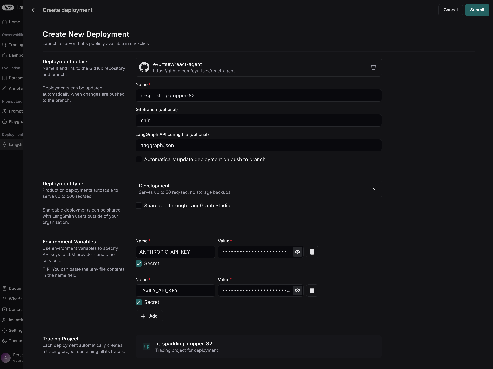
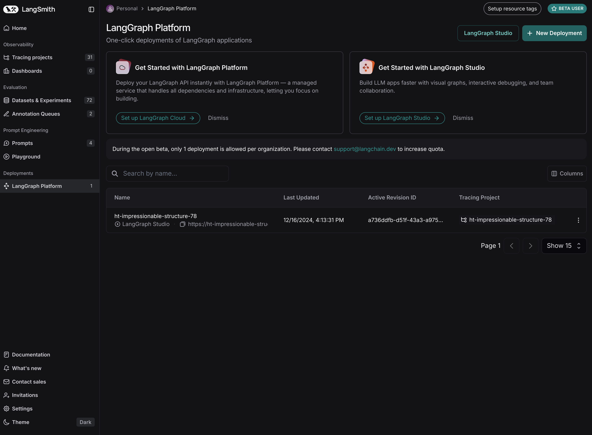
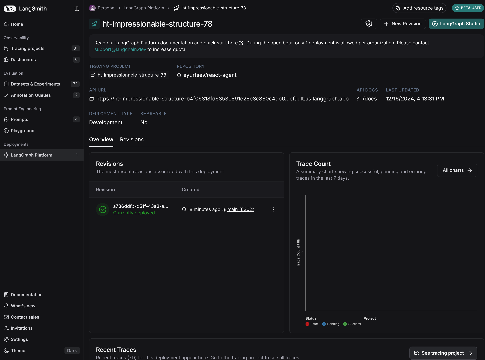
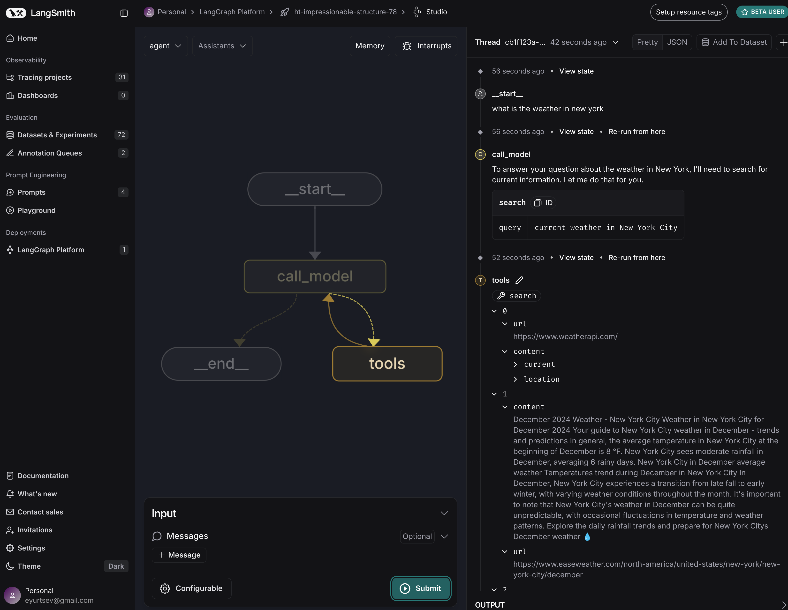

# 快速入门：在LangGraph云上部署

!!! note "先决条件"

    在开始之前，请确保您具备以下条件：

    - [GitHub账户](https://github.com/)
    - [LangSmith账户](https://smith.langchain.com/)

## 在GitHub上创建仓库

要将LangGraph应用程序部署到**LangGraph云**，您的应用程序代码必须位于GitHub仓库中。支持公共和私有仓库。

您可以将任何[LangGraph应用程序](../concepts/application_structure.md)部署到LangGraph云。

在本指南中，我们将使用预构建的Python [**ReAct Agent**](https://github.com/langchain-ai/react-agent)模板。

??? note "获取ReAct Agent模板所需的API密钥"

    此**ReAct Agent**应用程序需要来自[Anthropic](https://console.anthropic.com/)和[Tavily](https://app.tavily.com/)的API密钥。您可以通过在各自的网站上注册来获取这些API密钥。

    **替代方案**：如果您更喜欢不需要API密钥的脚手架应用程序，请使用[**New LangGraph Project**](https://github.com/langchain-ai/new-langgraph-project)模板，而不是**ReAct Agent**模板。

1. 转到[ReAct Agent](https://github.com/langchain-ai/react-agent)仓库。
2. 点击右上角的`Fork`按钮，将仓库分叉到您的GitHub账户。

## 部署到LangGraph云

??? note "1. 登录[LangSmith](https://smith.langchain.com/)"

    <figure markdown="1">
    [{: style="max-height:300px"}](deployment/img/01_login.png)
    <figcaption>
    转到[LangSmith](https://smith.langchain.com/)并登录。如果您没有账户，可以免费注册。
    </figcaption>
    </figure>

??? note "2. 点击<em>LangGraph平台</em>（左侧边栏）"

    <figure markdown="1">
    [{: style="max-height:300px"}](deployment/img/02_langgraph_platform.png)
    <figcaption>
    从左侧边栏中选择**LangGraph平台**。
    </figcaption>
    </figure>

??? note "3. 点击+ 新建部署（右上角）"

    <figure markdown="1">
    [{: style="max-height:300px"}](deployment/img/03_deployments_page.png)
    <figcaption>
    点击**+ 新建部署**以创建新部署。此按钮位于右上角。
    它将打开一个新模态窗口，您可以在其中填写所需字段。
    </figcaption>
    </figure>

??? note "4. 点击从GitHub导入（首次用户）"

    <figure markdown="1">
    [](deployment/img/04_create_new_deployment.png)
    <figcaption>
    点击**从GitHub导入**并按照说明连接您的GitHub账户。此步骤适用于**首次用户**或添加之前未连接的私有仓库。</figcaption>
        </figure>

??? note "5. 选择仓库，配置环境变量等"

    <figure markdown="1">
    [{: style="max-height:300px"}](deployment/img/05_configure_deployment.png)
    <figcaption>
    选择<strong>仓库</strong>，添加环境变量和密钥，并设置其他配置选项。
    </figcaption>
    </figure>

    - **仓库**：选择您之前分叉的仓库（或您想要部署的任何其他仓库）。
    - 设置您的应用程序所需的密钥和环境变量。对于**ReAct Agent**模板，您需要设置以下密钥：
        - **ANTHROPIC_API_KEY**：从[Anthropic](https://console.anthropic.com/)获取API密钥。
        - **TAVILY_API_KEY**：在[Tavily网站](https://app.tavily.com/)上获取API密钥。

??? note "6. 点击提交以部署！"

    <figure markdown="1">
    [{: style="max-height:300px"}](deployment/img/05_configure_deployment.png)
    <figcaption>
        请注意，此步骤可能需要~15分钟才能完成。您可以在**部署**视图中检查部署状态。
        点击右上角的<strong>提交</strong>按钮以部署您的应用程序。
    </figcaption>
    </figure>

## LangGraph Studio Web UI

一旦您的应用程序部署完成，您可以在**LangGraph Studio**中进行测试。

??? note "1. 点击现有部署"

    <figure markdown="1">
    [{: style="max-height:300px"}](deployment/img/07_deployments_page.png)
    <figcaption>
        点击您刚刚创建的部署以查看更多详细信息。
    </figcaption>
    </figure>

??? note "2. 点击LangGraph Studio"

    <figure markdown="1">
    [{: style="max-height:300px"}](deployment/img/08_deployment_view.png)
    <figcaption>
        点击<strong>LangGraph Studio</strong>按钮以打开LangGraph Studio。
    </figcaption>
    </figure>

<figure markdown="1">
[{: style="max-height:400px"}](deployment/img/09_langgraph_studio.png)
<figcaption>
    LangGraph Studio中的示例图运行。
</figcaption>
</figure>

## 测试API

!!! note

    以下API调用适用于**ReAct Agent**模板。如果您部署的是不同的应用程序，可能需要相应地调整API调用。

在使用之前，您需要获取LangGraph部署的`URL`。您可以在`部署`视图中找到它。点击`URL`将其复制到剪贴板。

您还需要确保已正确设置API密钥，以便您可以与LangGraph云进行身份验证。

```shell
export LANGSMITH_API_KEY=...
```

=== "Python SDK（异步）"

    **安装LangGraph Python SDK**

    ```shell
    pip install langgraph-sdk
    ```

    **向助手发送消息（无线程运行）**

    ```python
    from langgraph_sdk import get_client

    client = get_client(url="your-deployment-url", api_key="your-langsmith-api-key")

    async for chunk in client.runs.stream(
        None,  # 无线程运行
        "agent", # 助手名称。在langgraph.json中定义。
        input={
            "messages": [{
                "role": "human",
                "content": "What is LangGraph?",
            }],
        },
        stream_mode="updates",
    ):
        print(f"Receiving new event of type: {chunk.event}...")
        print(chunk.data)
        print("\n\n")
    ```

=== "Python SDK（同步）"

    **安装LangGraph Python SDK**

    ```shell
    pip install langgraph-sdk
    ```

    **向助手发送消息（无线程运行）**

    ```python
    from langgraph_sdk import get_sync_client

    client = get_sync_client(url="your-deployment-url", api_key="your-langsmith-api-key")

    for chunk in client.runs.stream(
        None,  # 无线程运行
        "agent", # 助手名称。在langgraph.json中定义。
        input={
            "messages": [{
                "role": "human",
                "content": "What is LangGraph?",
            }],
        },
        stream_mode="updates",
    ):
        print(f"Receiving new event of type: {chunk.event}...")
        print(chunk.data)
        print("\n\n")
    ```

=== "Javascript SDK"

    **安装LangGraph JS SDK**

    ```shell
    npm install @langchain/langgraph-sdk
    ```

    **向助手发送消息（无线程运行）**

    ```js
    const { Client } = await import("@langchain/langgraph-sdk");

    const client = new Client({ apiUrl: "your-deployment-url", apiKey: "your-langsmith-api-key" });

    const streamResponse = client.runs.stream(
        null, // 无线程运行
        "agent", // 助手ID
        {
            input: {
                "messages": [
                    { "role": "user", "content": "What is LangGraph?"}
                ]
            },
            streamMode: "messages",
        }
    );

    for await (const chunk of streamResponse) {
        console.log(`Receiving new event of type: ${chunk.event}...`);
        console.log(JSON.stringify(chunk.data));
        console.log("\n\n");
    }
    ```

=== "Rest API"

    ```bash
    curl -s --request POST \
        --url <DEPLOYMENT_URL> \
        --header 'Content-Type: application/json' \
        --data "{
            \"assistant_id\": \"agent\",
            \"input\": {
                \"messages\": [
                    {
                        \"role\": \"human\",
                        \"content\": \"What is LangGraph?\"
                    }
                ]
            },
            \"stream_mode\": \"updates\"
        }" 
    ```

## 下一步

恭喜！如果您已经完成了本教程，那么您已经迈出了成为LangGraph云专家的第一步。以下是一些其他资源，可以帮助您在成为专家的道路上更进一步：

### LangGraph框架

- **[LangGraph教程](../tutorials/introduction.ipynb)**：开始使用LangGraph框架。
- **[LangGraph概念](../concepts/index.md)**：学习LangGraph的基础概念。
- **[LangGraph操作指南](../how-tos/index.md)**：LangGraph常见任务的指南。

### 📚 了解更多关于LangGraph平台的信息

通过这些资源扩展您的知识：

- **[LangGraph平台概念](../concepts/index.md#langgraph-platform)**：了解LangGraph平台的基础概念。
- **[LangGraph平台操作指南](../how-tos/index.md#langgraph-platform)**：发现构建和部署应用程序的分步指南。
- **[启动本地LangGraph服务器](../tutorials/langgraph-platform/local-server.md)**：此快速入门指南展示了如何为**ReAct Agent**模板在本地启动LangGraph服务器。其他模板的步骤类似。