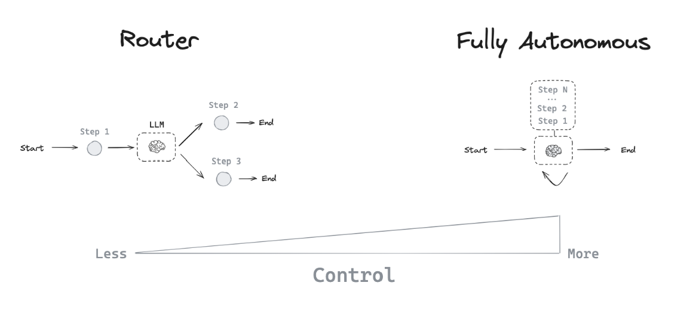

# 代理架构

许多LLM应用程序在调用LLM之前和/或之后实现特定的控制流程步骤。例如，[RAG](https://github.com/langchain-ai/rag-from-scratch) 执行与用户问题相关的文档检索，并将这些文档传递给LLM，以便模型的响应基于提供的文档上下文。

与其硬编码固定的控制流程，我们有时希望LLM系统能够选择自己的控制流程来解决更复杂的问题！这是[代理](https://blog.langchain.dev/what-is-an-agent/)的一个定义：*代理是一个使用LLM来决定应用程序控制流程的系统。* LLM可以通过多种方式控制应用程序：

- LLM可以在两个潜在路径之间进行路由
- LLM可以决定调用多个工具中的哪一个
- LLM可以决定生成的答案是否足够，或者是否需要更多工作

因此，存在许多不同类型的[代理架构](https://blog.langchain.dev/what-is-a-cognitive-architecture/)，它们赋予LLM不同层次的控制权。

## 路由器

路由器允许LLM从一组指定的选项中选择一个步骤。这是一种控制水平相对有限的代理架构，因为LLM通常专注于做出一个决策，并从一组有限的预定义选项中产生特定的输出。路由器通常采用几种不同的概念来实现这一点。

### 结构化输出

LLM的结构化输出通过提供特定的格式或模式来实现，LLM应在其响应中遵循该格式或模式。这与工具调用类似，但更通用。虽然工具调用通常涉及选择和使用预定义的函数，但结构化输出可以用于任何类型的格式化响应。实现结构化输出的常见方法包括：

1. 提示工程：通过系统提示指示LLM以特定格式响应。
2. 输出解析器：使用后处理从LLM响应中提取结构化数据。
3. 工具调用：利用某些LLM的内置工具调用功能生成结构化输出。

结构化输出对于路由至关重要，因为它们确保系统的决策可以被可靠地解释和执行。了解更多关于[结构化输出的指南](https://python.langchain.com/docs/how_to/structured_output/)。

## 工具调用代理

虽然路由器允许LLM做出一个决策，但更复杂的代理架构通过两种关键方式扩展了LLM的控制：

1. 多步决策：LLM可以做出连续的决策，而不仅仅是一个。
2. 工具访问：LLM可以从多种工具中选择并使用它们来完成任务。

[ReAct](https://arxiv.org/abs/2210.03629) 是一种流行的通用代理架构，结合了这些扩展，集成了三个核心概念。

1. `工具调用`：允许LLM根据需要选择和使用各种工具。
2. `记忆`：使代理能够保留和使用之前步骤中的信息。
3. `规划`：使LLM能够创建并遵循多步计划以实现目标。

这种架构允许更复杂和灵活的代理行为，超越简单的路由，实现动态的多步问题解决。你可以使用[`create_react_agent`][langgraph.prebuilt.chat_agent_executor.create_react_agent]来使用它。

### 工具调用

工具在希望代理与外部系统交互时非常有用。外部系统（例如API）通常需要特定的输入模式或有效载荷，而不是自然语言。例如，当我们将API绑定为工具时，我们为模型提供了所需输入模式的意识。模型将根据用户的自然语言输入选择调用工具，并返回符合工具所需模式的输出。

[许多LLM提供商支持工具调用](https://python.langchain.com/docs/integrations/chat/)和[LangChain中的工具调用接口](https://blog.langchain.dev/improving-core-tool-interfaces-and-docs-in-langchain/)很简单：你只需将任何Python `函数`传递给`ChatModel.bind_tools(function)`。

### 记忆

记忆对代理至关重要，使它们能够在问题解决的多个步骤中保留和利用信息。它在不同的尺度上运作：

1. 短期记忆：允许代理访问在序列中较早步骤中获取的信息。
2. 长期记忆：使代理能够回忆之前交互中的信息，例如对话中的过去消息。

LangGraph提供了对记忆实现的完全控制：

- [`状态`](./low_level.md#state)：用户定义的模式，指定要保留的记忆的确切结构。
- [`检查点`](./persistence.md)：在不同交互的每一步存储状态的机制。

这种灵活的方法允许你根据特定的代理架构需求定制记忆系统。有关如何在图中添加记忆的实用指南，请参阅[本教程](../how-tos/persistence.ipynb)。

有效的记忆管理增强了代理维护上下文、从过去的经验中学习并随着时间的推移做出更明智决策的能力。

### 规划

在ReAct架构中，LLM在while循环中被反复调用。在每一步中，代理决定调用哪些工具，以及这些工具的输入应该是什么。然后这些工具被执行，输出作为观察结果反馈给LLM。当代理决定它拥有足够的信息来解决用户请求并且不值得再调用任何工具时，while循环终止。

### ReAct实现

[这篇](https://arxiv.org/abs/2210.03629)论文与预构建的[`create_react_agent`][langgraph.prebuilt.chat_agent_executor.create_react_agent]实现之间存在几个差异：

- 首先，我们使用[工具调用](#tool-calling)让LLM调用工具，而论文使用提示+原始输出的解析。这是因为论文写作时工具调用还不存在，但现在它通常更好且更可靠。
- 其次，我们使用消息来提示LLM，而论文使用字符串格式化。这是因为在写作时，LLM甚至没有暴露基于消息的接口，而现在这是它们暴露的唯一接口。
- 第三，论文要求所有工具输入必须为单个字符串。这主要是由于当时LLM的能力有限，只能生成单个输入。我们的实现允许使用需要多个输入的工具。
- 第四，论文只考虑一次调用一个工具，主要是由于当时LLM性能的限制。我们的实现允许一次调用多个工具。
- 最后，论文要求LLM在决定调用哪些工具之前明确生成一个“思考”步骤。这是“ReAct”中的“推理”部分。我们的实现默认不这样做，主要是因为LLM已经变得更好，不再那么必要。当然，如果你希望提示它这样做，你当然可以。

## 自定义代理架构

虽然路由器和工具调用代理（如ReAct）很常见，但[自定义代理架构](https://blog.langchain.dev/why-you-should-outsource-your-agentic-infrastructure-but-own-your-cognitive-architecture/)通常可以为特定任务带来更好的性能。LangGraph提供了几个强大的功能来构建定制的代理系统：

### 人在环

人的参与可以显著提高代理的可靠性，特别是在敏感任务中。这可能涉及：

- 批准特定操作
- 提供反馈以更新代理的状态
- 在复杂的决策过程中提供指导

当完全自动化不可行或不理想时，人在环模式至关重要。了解更多请参阅我们的[人在环指南](./human_in_the_loop.md)。

### 并行化

并行处理对于高效的多代理系统和复杂任务至关重要。LangGraph通过其[发送](./low_level.md#send)API支持并行化，实现：

- 多个状态的并发处理
- 实现类似map-reduce的操作
- 高效处理独立的子任务

有关实际实现，请参阅我们的[map-reduce教程](../how-tos/map-reduce.ipynb)。

### 子图

[子图](./low_level.md#subgraphs)对于管理复杂的代理架构至关重要，特别是在[多代理系统](./multi_agent.md)中。它们允许：

- 为单个代理隔离状态管理
- 代理团队的分层组织
- 代理与主系统之间的受控通信

子图通过状态模式中的重叠键与父图通信。这使得设计灵活、模块化的代理成为可能。有关实现细节，请参阅我们的[子图指南](../how-tos/subgraph.ipynb)。

### 反思

反思机制可以显著提高代理的可靠性，通过：

1. 评估任务完成情况和正确性
2. 提供反馈以进行迭代改进
3. 实现自我纠正和学习

虽然反思通常基于LLM，但也可以使用确定性方法。例如，在编码任务中，编译错误可以作为反馈。这种方法在[这个使用LangGraph进行自我纠正代码生成的视频](https://www.youtube.com/watch?v=MvNdgmM7uyc)中得到了演示。

通过利用这些功能，LangGraph能够创建复杂、任务特定的代理架构，这些架构可以处理复杂的工作流程，有效协作，并不断提高其性能。