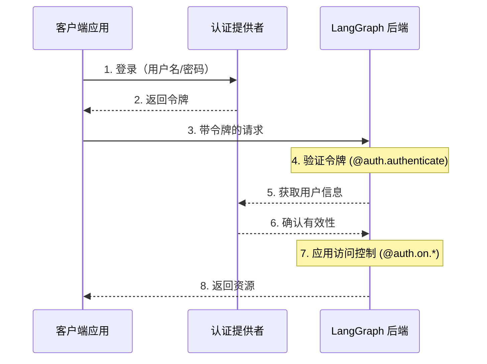

# 认证与访问控制

LangGraph 平台提供了一个灵活的认证和授权系统，可以与大多数认证方案集成。

!!! note "仅限 Python"

    我们目前仅在 Python 部署中支持自定义认证和授权，要求 `langgraph-api>=0.0.11`。对 LangGraph.JS 的支持将很快添加。

## 核心概念

### 认证 vs 授权

虽然这些术语经常互换使用，但它们代表了不同的安全概念：

- [**认证**](#authentication) ("AuthN") 验证 _你是谁_。这作为中间件在每个请求上运行。
- [**授权**](#authorization) ("AuthZ") 确定 _你能做什么_。这在每个资源的基础上验证用户的权限和角色。

在 LangGraph 平台中，认证由你的 [`@auth.authenticate`](../cloud/reference/sdk/python_sdk_ref.md#langgraph_sdk.auth.Auth.authenticate) 处理程序处理，授权由你的 [`@auth.on`](../cloud/reference/sdk/python_sdk_ref.md#langgraph_sdk.auth.Auth.on) 处理程序处理。

## 默认安全模型

LangGraph 平台提供了不同的安全默认值：

### LangGraph 云

- 默认使用 LangSmith API 密钥
- 需要在 `x-api-key` 头中提供有效的 API 密钥
- 可以使用你的认证处理程序进行自定义

!!! note "自定义认证"
    自定义认证 **支持** LangGraph 云的所有计划。

### 自托管

- 无默认认证
- 完全灵活地实现你的安全模型
- 你控制认证和授权的所有方面

!!! note "自定义认证"
    自定义认证支持 **企业** 自托管计划。自托管轻量版计划本身不支持自定义认证。

## 系统架构

典型的认证设置涉及三个主要组件：

1. **认证提供者**（身份提供者/IdP）

    * 一个专门管理用户身份和凭证的服务
    * 处理用户注册、登录、密码重置等
    * 在成功认证后颁发令牌（JWT、会话令牌等）
    * 示例：Auth0、Supabase Auth、Okta 或你自己的认证服务器

2. **LangGraph 后端**（资源服务器）

    * 包含业务逻辑和受保护资源的 LangGraph 应用程序
    * 与认证提供者验证令牌
    * 基于用户身份和权限强制执行访问控制
    * 不直接存储用户凭证

3. **客户端应用程序**（前端）

    * Web 应用、移动应用或 API 客户端
    * 收集时效性用户凭证并发送给认证提供者
    * 从认证提供者接收令牌
    * 在请求 LangGraph 后端时包含这些令牌

以下是这些组件通常如何交互：



你的 LangGraph 中的 [`@auth.authenticate`](../cloud/reference/sdk/python_sdk_ref.md#langgraph_sdk.auth.Auth.authenticate) 处理程序处理步骤 4-6，而你的 [`@auth.on`](../cloud/reference/sdk/python_sdk_ref.md#langgraph_sdk.auth.Auth.on) 处理程序实现步骤 7。

## 认证

LangGraph 中的认证作为中间件在每个请求上运行。你的 [`@auth.authenticate`](../cloud/reference/sdk/python_sdk_ref.md#langgraph_sdk.auth.Auth.authenticate) 处理程序接收请求信息并应：

1. 验证凭证
2. 如果有效，返回包含用户身份和用户信息的 [用户信息](../cloud/reference/sdk/python_sdk_ref.md#langgraph_sdk.auth.types.MinimalUserDict)
3. 如果无效，引发 [HTTP 异常](../cloud/reference/sdk/python_sdk_ref.md#langgraph_sdk.auth.exceptions.HTTPException) 或 AssertionError

```python
from langgraph_sdk import Auth

auth = Auth()

@auth.authenticate
async def authenticate(headers: dict) -> Auth.types.MinimalUserDict:
    # 验证凭证（例如，API 密钥、JWT 令牌）
    api_key = headers.get("x-api-key")
    if not api_key or not is_valid_key(api_key):
        raise Auth.exceptions.HTTPException(
            status_code=401,
            detail="无效的 API 密钥"
        )

    # 返回用户信息 - 只有 identity 和 is_authenticated 是必需的
    # 添加你需要的任何其他字段以进行授权
    return {
        "identity": "user-123",        # 必需：唯一用户标识符
        "is_authenticated": True,      # 可选：默认为 True
        "permissions": ["read", "write"] # 可选：用于基于权限的认证
        # 你可以添加更多自定义字段，如果你想实现其他认证模式
        "role": "admin",
        "org_id": "org-456"

    }
```

返回的用户信息可用于：

- 通过 [`ctx.user`](../cloud/reference/sdk/python_sdk_ref.md#langgraph_sdk.auth.types.AuthContext) 访问你的授权处理程序
- 通过 `config["configuration"]["langgraph_auth_user"]` 访问你的应用程序

??? tip "支持的参数"

    [`@auth.authenticate`](../cloud/reference/sdk/python_sdk_ref.md#langgraph_sdk.auth.Auth.authenticate) 处理程序可以按名称接受以下任何参数：

    * request (Request): 原始 ASGI 请求对象
    * body (dict): 解析后的请求体
    * path (str): 请求路径，例如 "/threads/abcd-1234-abcd-1234/runs/abcd-1234-abcd-1234/stream"
    * method (str): HTTP 方法，例如 "GET"
    * path_params (dict[str, str]): URL 路径参数，例如 {"thread_id": "abcd-1234-abcd-1234", "run_id": "abcd-1234-abcd-1234"}
    * query_params (dict[str, str]): URL 查询参数，例如 {"stream": "true"}
    * headers (dict[bytes, bytes]): 请求头
    * authorization (str | None): Authorization 头值（例如，"Bearer <token>"）
    
    在我们的许多教程中，为了简洁起见，我们只展示 "authorization" 参数，但你可以根据需要选择接受更多信息来实现你的自定义认证方案。

## 授权

认证后，LangGraph 调用你的 [`@auth.on`](../cloud/reference/sdk/python_sdk_ref.md#langgraph_sdk.auth.Auth.on) 处理程序以控制对特定资源（例如，线程、助手、定时任务）的访问。这些处理程序可以：

1. 通过直接修改 `value["metadata"]` 字典来添加要在资源创建期间保存的元数据。请参阅 [支持的操作表](##supported-actions) 以获取每个操作的值类型列表。
2. 在搜索/列表或读取操作期间，通过返回 [过滤字典](#filter-operations) 来按元数据过滤资源。
3. 如果访问被拒绝，则引发 HTTP 异常。

如果你只想实现简单的用户范围访问控制，你可以为所有资源和操作使用一个 [`@auth.on`](../cloud/reference/sdk/python_sdk_ref.md#langgraph_sdk.auth.Auth.on) 处理程序。如果你想根据资源和操作有不同的控制，你可以使用 [资源特定的处理程序](#resource-specific-handlers)。请参阅 [支持的资源](#supported-resources) 部分以获取支持访问控制的资源的完整列表。

```python
@auth.on
async def add_owner(
    ctx: Auth.types.AuthContext,
    value: dict  # 发送到此访问方法的有效负载
) -> dict:  # 返回一个过滤字典，限制对资源的访问
    """授权对线程、运行、定时任务和助手的访问。

    此处理程序做两件事：
        - 向资源元数据添加一个值（以便与资源一起持久化，以便以后可以过滤）
        - 返回一个过滤器（以限制对现有资源的访问）

    参数：
        ctx: 包含用户信息、权限、路径和
        value: 发送到端点的请求有效负载。对于创建
              操作，这包含资源参数。对于读取
              操作，这包含正在访问的资源。

    返回：
        一个过滤字典，LangGraph 使用它来限制对资源的访问。
        请参阅 [过滤操作](#filter-operations) 以获取支持的运算符。
    """
    # 创建过滤器以限制仅访问此用户的资源
    filters = {"owner": ctx.user.identity}

    # 获取或创建有效负载中的元数据字典
    # 这是我们存储有关资源的持久信息的地方
    metadata = value.setdefault("metadata", {})

    # 向元数据添加所有者 - 如果这是创建或更新操作，
    # 此信息将与资源一起保存
    # 因此我们可以在以后的读取操作中按它进行过滤
    metadata.update(filters)

    # 返回过滤器以限制访问
    # 这些过滤器应用于所有操作（创建、读取、更新、搜索等）
    # 以确保用户只能访问自己的资源
    return filters
```

### 资源特定的处理程序 {#resource-specific-handlers}

你可以通过将资源名称和操作名称与 [`@auth.on`](../cloud/reference/sdk/python_sdk_ref.md#langgraph_sdk.auth.Auth.on) 装饰器链接在一起来为特定资源和操作注册处理程序。
当发出请求时，将调用与该资源和操作匹配的最具体的处理程序。以下是如何为特定资源和操作注册处理程序的示例。对于以下设置：

1. 认证用户能够创建线程、读取线程、在线程上创建运行
2. 只有具有 "assistants:create" 权限的用户才允许创建新助手
3. 所有其他端点（例如，删除助手、定时任务、存储）对所有用户禁用。

!!! tip "支持的处理程序"

    有关支持的资源和操作的完整列表，请参阅下面的 [支持的资源](#supported-resources) 部分。

```python
# 通用 / 全局处理程序捕获未被更具体处理程序处理的调用
@auth.on
async def reject_unhandled_requests(ctx: Auth.types.AuthContext, value: Any) -> False:
    print(f"请求到 {ctx.path} 由 {ctx.user.identity}")
    raise Auth.exceptions.HTTPException(
        status_code=403,
        detail="禁止"
    )

# 匹配 "thread" 资源和所有操作 - 创建、读取、更新、删除、搜索
# 由于这比通用 @auth.on 处理程序 **更具体**，它将优先
# 于通用处理程序对 "threads" 资源的所有操作
@auth.on.threads
async def on_thread_create(
    ctx: Auth.types.AuthContext,
    value: Auth.types.threads.create.value
):
    if "write" not in ctx.permissions:
        raise Auth.exceptions.HTTPException(
            status_code=403,
            detail="用户缺少所需的权限。"
        )
    # 在正在创建的线程上设置元数据
    # 将确保资源包含 "owner" 字段
    # 然后每当用户尝试访问此线程或线程中的运行时，
    # 我们可以按所有者进行过滤
    metadata = value.setdefault("metadata", {})
    metadata["owner"] = ctx.user.identity
    return {"owner": ctx.user.identity}

# 线程创建。这将仅匹配线程创建操作
# 由于这比通用 @auth.on 处理程序和 @auth.on.threads 处理程序 **更具体**，
# 它将优先于任何 "create" 操作对 "threads" 资源的处理
@auth.on.threads.create
async def on_thread_create(
    ctx: Auth.types.AuthContext,
    value: Auth.types.threads.create.value
):
    # 在正在创建的线程上设置元数据
    # 将确保资源包含 "owner" 字段
    # 然后每当用户尝试访问此线程或线程中的运行时，
    # 我们可以按所有者进行过滤
    metadata = value.setdefault("metadata", {})
    metadata["owner"] = ctx.user.identity
    return {"owner": ctx.user.identity}

# 读取线程。由于这也比通用 @auth.on 处理程序和 @auth.on.threads 处理程序 **更具体**，
# 它将优先于任何 "read" 操作对 "threads" 资源的处理
@auth.on.threads.read
async def on_thread_read(
    ctx: Auth.types.AuthContext,
    value: Auth.types.threads.read.value
):
    # 由于我们正在读取（而不是创建）线程，
    # 我们不需要设置元数据。我们只需要
    # 返回一个过滤器以确保用户只能看到自己的线程
    return {"owner": ctx.user.identity}

# 运行创建、流式传输、更新等。
# 这将优先于通用 @auth.on 处理程序和 @auth.on.threads 处理程序
@auth.on.threads.create_run
async def on_run_create(
    ctx: Auth.types.AuthContext,
    value: Auth.types.threads.create_run.value
):
    metadata = value.setdefault("metadata", {})
    metadata["owner"] = ctx.user.identity
    # 继承线程的访问控制
    return {"owner": ctx.user.identity}

# 助手创建
@auth.on.assistants.create
async def on_assistant_create(
    ctx: Auth.types.AuthContext,
    value: Auth.types.assistants.create.value
):
    if "assistants:create" not in ctx.permissions:
        raise Auth.exceptions.HTTPException(
            status_code=403,
            detail="用户缺少所需的权限。"
        )
```

注意，我们在上面的示例中混合了全局和资源特定的处理程序。由于每个请求都由最具体的处理程序处理，因此创建 `thread` 的请求将匹配 `on_thread_create` 处理程序，但不会匹配 `reject_unhandled_requests` 处理程序。然而，更新线程的请求将由全局处理程序处理，因为我们没有针对该资源和操作的更具体的处理程序。创建、更新的请求，

### 过滤操作 {#filter-operations}

授权处理程序可以返回 `None`、布尔值或过滤字典。
- `None` 和 `True` 表示 "授权访问所有底层资源"
- `False` 表示 "拒绝访问所有底层资源（引发 403 异常）"
- 元数据过滤字典将限制对资源的访问

过滤字典是一个键与资源元数据匹配的字典。它支持三个运算符：

- 默认值是精确匹配的简写，或 "$eq"，如下所示。例如，`{"owner": user_id}` 将仅包括元数据包含 `{"owner": user_id}` 的资源
- `$eq`: 精确匹配（例如，`{"owner": {"$eq": user_id}}`）- 这等同于上面的简写，`{"owner": user_id}`
- `$contains`: 列表成员资格（例如，`{"allowed_users": {"$contains": user_id}}`）这里的值必须是列表的一个元素。存储资源中的元数据必须是列表/容器类型。

具有多个键的字典被视为使用逻辑 `AND` 过滤器。例如，`{"owner": org_id, "allowed_users": {"$contains": user_id}}` 将仅匹配元数据的 "owner" 为 `org_id` 且 "allowed_users" 列表包含 `user_id` 的资源。
有关更多信息，请参阅 [这里](../cloud/reference/sdk/python_sdk_ref.md#langgraph_sdk.auth.types.FilterType) 的参考。

## 常见访问模式

以下是一些典型的授权模式：

### 单一所有者资源

这种常见模式允许你将所有线程、助手、定时任务和运行限定为单个用户。它适用于常见的单用户用例，如常规聊天机器人式应用程序。

```python
@auth.on
async def owner_only(ctx: Auth.types.AuthContext, value: dict):
    metadata = value.setdefault("metadata", {})
    metadata["owner"] = ctx.user.identity
    return {"owner": ctx.user.identity}
```

### 基于权限的访问

这种模式允许你基于 **权限** 控制访问。如果你希望某些角色对资源具有更广泛或更受限的访问权限，这很有用。

```python
# 在你的认证处理程序中：
@auth.authenticate
async def authenticate(headers: dict) -> Auth.types.MinimalUserDict:
    ...
    return {
        "identity": "user-123",
        "is_authenticated": True,
        "permissions": ["threads:write", "threads:read"]  # 在认证中定义权限
    }

def _default(ctx: Auth.types.AuthContext, value: dict):
    metadata = value.setdefault("metadata", {})
    metadata["owner"] = ctx.user.identity
    return {"owner": ctx.user.identity}

@auth.on.threads.create
async def create_thread(ctx: Auth.types.AuthContext, value: dict):
    if "threads:write" not in ctx.permissions:
        raise Auth.exceptions.HTTPException(
            status_code=403,
            detail="未经授权"
        )
    return _default(ctx, value)


@auth.on.threads.read
async def rbac_create(ctx: Auth.types.AuthContext, value: dict):
    if "threads:read" not in ctx.permissions and "threads:write" not in ctx.permissions:
        raise Auth.exceptions.HTTPException(
            status_code=403,
            detail="未经授权"
        )
    return _default(ctx, value)
```

## 支持的资源

LangGraph 提供了三个级别的授权处理程序，从最通用到最具体：

1. **全局处理程序** (`@auth.on`): 匹配所有资源和操作
2. **资源处理程序**（例如，`@auth.on.threads`、`@auth.on.assistants`、`@auth.on.crons`): 匹配特定资源的所有操作
3. **操作处理程序**（例如，`@auth.on.threads.create`、`@auth.on.threads.read`): 匹配特定资源上的特定操作

将使用最具体的匹配处理程序。例如，`@auth.on.thread