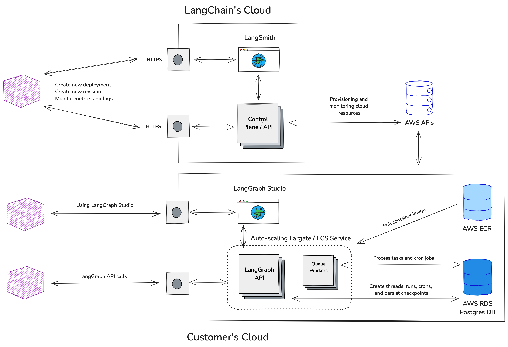

# 自带云 (BYOC)

!!! 注意 先决条件

    - [LangGraph 平台](./langgraph_platform.md)
    - [部署选项](./deployment_options.md)

## 架构

分离控制平面（由我们托管）和数据平面（由您托管，由我们管理）。

|                             | 控制平面                     | 数据平面                                    |
|-----------------------------|------------------------------|-------------------------------------------|
| 功能                        | 管理部署、版本。              | 运行您的 LangGraph 图，存储您的数据。      |
| 托管位置                    | LangChain 云账户              | 您的云账户                                 |
| 由谁提供和监控              | LangChain                    | LangChain                                 |

LangChain 无法直接访问您在云账户中创建的资源，只能通过 AWS API 与其交互。您的数据在静态或传输过程中永远不会离开您的云账户 / VPC。

## 要求

- 您已经在使用 AWS。
- 您使用 `langgraph-cli` 和/或 [LangGraph Studio](./langgraph_studio.md) 应用程序在本地测试图。
- 您使用 `langgraph build` 命令构建镜像，然后将其推送到您的 AWS ECR 仓库（`docker push`）。

## 工作原理

- 我们为您提供一个 [Terraform 模块](https://github.com/langchain-ai/terraform/tree/main/modules/langgraph_cloud_setup)，您运行该模块以设置我们的要求
    1. 创建一个 AWS 角色（我们的控制平面稍后将承担该角色以提供和监控资源）
        - https://docs.aws.amazon.com/aws-managed-policy/latest/reference/AmazonVPCReadOnlyAccess.html
            - 读取 VPC 以查找子网
        - https://docs.aws.amazon.com/aws-managed-policy/latest/reference/AmazonECS_FullAccess.html
            - 用于为您的 LangGraph 云实例创建/删除 ECS 资源
        - https://docs.aws.amazon.com/aws-managed-policy/latest/reference/SecretsManagerReadWrite.html
            - 为您的 ECS 资源创建密钥
        - https://docs.aws.amazon.com/aws-managed-policy/latest/reference/CloudWatchReadOnlyAccess.html
            - 读取 CloudWatch 指标/日志以监控您的实例/推送部署日志
        - https://docs.aws.amazon.com/aws-managed-policy/latest/reference/AmazonRDSFullAccess.html
            - 为您的 LangGraph 云实例提供 `RDS` 实例
            - 或者，可以使用外部托管的 Postgres 实例代替默认的 `RDS` 实例。LangChain 不监控或管理外部托管的 Postgres 实例。有关 [`POSTGRES_URI_CUSTOM` 环境变量](../cloud/reference/env_var.md#postgres_uri_custom) 的详细信息，请参见。
    2. 要么
        - 将现有的 vpc / 子网标记为 `langgraph-cloud-enabled`
        - 创建一个新的 vpc 和子网并将其标记为 `langgraph-cloud-enabled`
- 您在 `smith.langchain.com` 上创建一个 LangGraph 云项目，提供
    - 在上述步骤中创建的 AWS 角色的 ID
    - 用于拉取服务镜像的 AWS ECR 仓库
- 我们使用上述角色在您的云账户中提供资源
- 我们监控这些资源以确保正常运行时间并从错误中恢复

对于使用 [自托管 LangSmith](https://docs.smith.langchain.com/self_hosting) 的客户的注意事项：

- 目前，新的 LangGraph 云项目和版本的创建需要在 `smith.langchain.com` 上完成。
- 但是，您可以将项目设置为跟踪到您自托管的 LangSmith 实例（如果需要）。有关 [`LANGSMITH_RUNS_ENDPOINTS` 环境变量](../cloud/reference/env_var.md#langsmith_runs_endpoints) 的详细信息，请参见。