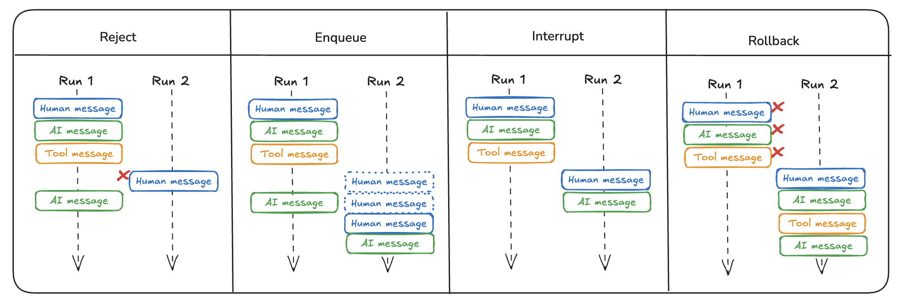

# 双发消息

!!! info "前提条件"
    - [LangGraph 服务器](./langgraph_server.md)

很多时候，用户可能会以非预期的方式与你的图进行交互。例如，用户可能会发送一条消息，在图运行完成之前又发送第二条消息。更一般地说，用户可能会在第一次运行完成之前再次调用图。我们称这种情况为“双发消息”。

目前，LangGraph 仅在 [LangGraph 平台](langgraph_platform.md) 中处理这个问题，而不是在开源版本中。原因在于，为了处理这种情况，我们需要知道图是如何部署的，而由于 LangGraph 平台负责部署，因此逻辑需要放在那里。如果你不想使用 LangGraph 平台，我们在下面详细描述了我们已实现的选项。

## 拒绝

这是最简单的选项，它只是拒绝任何后续运行，不允许双发消息。请参阅 [操作指南](../cloud/how-tos/reject_concurrent.md) 了解如何配置拒绝双发消息的选项。

## 排队

这是一个相对简单的选项，它继续第一次运行直到整个运行完成，然后将新的输入作为单独的运行发送。请参阅 [操作指南](../cloud/how-tos/enqueue_concurrent.md) 了解如何配置排队处理双发消息的选项。

## 中断

这个选项会中断当前执行，但会保存到目前为止完成的所有工作。然后插入用户输入并从那里继续。

如果你启用这个选项，你的图应该能够处理可能出现的奇怪边缘情况。例如，你可能已经调用了工具，但尚未获得该工具运行的结果。你可能需要删除该工具调用，以避免挂起的工具调用。

请参阅 [操作指南](../cloud/how-tos/interrupt_concurrent.md) 了解如何配置中断处理双发消息的选项。

## 回滚

这个选项会中断当前执行并回滚到目前为止完成的所有工作，包括原始运行的输入。然后发送新的用户输入，基本上就像它是原始输入一样。

请参阅 [操作指南](../cloud/how-tos/rollback_concurrent.md) 了解如何配置回滚处理双发消息的选项。