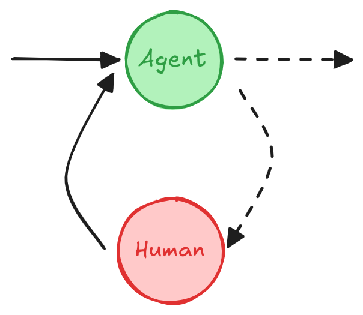

# 人在回路

!!! tip "本指南使用新的 `interrupt` 函数。"

    自 LangGraph 0.2.57 起，推荐使用 [`interrupt` 函数][langgraph.types.interrupt] 来设置断点，因为它简化了**人在回路**模式。

    如果你在寻找之前版本的此概念指南，它依赖于静态断点和 `NodeInterrupt` 异常，可以在这里找到 [v0 人在回路](v0-human-in-the-loop.md)。

**人在回路**（或“在环中”）工作流将人工输入集成到自动化流程中，允许在关键阶段进行决策、验证或纠正。这在**基于 LLM 的应用**中尤其有用，因为底层模型可能会偶尔生成不准确的内容。在低错误容忍度的场景中，如合规性、决策或内容生成，人工参与通过审查、纠正或覆盖模型输出来确保可靠性。

## 使用场景

在基于 LLM 的应用中，**人在回路**工作流的关键使用场景包括：

1. [**🛠️ 审查工具调用**](#review-tool-calls)：在工具执行之前，人工可以审查、编辑或批准 LLM 请求的工具调用。
2. **✅ 验证 LLM 输出**：人工可以审查、编辑或批准 LLM 生成的内容。
3. **💡 提供上下文**：使 LLM 能够明确请求人工输入以澄清或获取更多细节，或支持多轮对话。

## `interrupt`

LangGraph 中的 [`interrupt` 函数][langgraph.types.interrupt] 通过在特定节点暂停图、向人工展示信息并在人工输入后恢复图来实现人在回路工作流。此函数适用于批准、编辑或收集额外输入等任务。[`interrupt` 函数][langgraph.types.interrupt] 与 [`Command`](../reference/types.md#langgraph.types.Command) 对象结合使用，以人工提供的值恢复图。

```python
from langgraph.types import interrupt

def human_node(state: State):
    value = interrupt(
        # 任何可 JSON 序列化的值，展示给人工。
        # 例如，一个问题、一段文本或状态中的一组键
       {
          "text_to_revise": state["some_text"]
       }
    )
    # 使用人工的输入更新状态或根据输入路由图。
    return {
        "some_text": value
    }

graph = graph_builder.compile(
    checkpointer=checkpointer # `interrupt` 工作需要
)

# 运行图直到中断
thread_config = {"configurable": {"thread_id": "some_id"}}
graph.invoke(some_input, config=thread_config)
    
# 使用人工的输入恢复图
graph.invoke(Command(resume=value_from_human), config=thread_config)
```

```pycon
{'some_text': '编辑后的文本'}
```

!!! warning
      中断功能强大且符合人体工程学。然而，尽管它们在开发者体验上可能类似于 Python 的 input() 函数，但需要注意的是，它们不会自动从中断点恢复执行。相反，它们会重新运行使用中断的整个节点。
      因此，中断通常最好放置在节点的开头或专用节点中。请阅读 [从中断恢复](#how-does-resuming-from-an-interrupt-work) 部分以获取更多详细信息。

??? "完整代码"

      以下是如何在图中使用 `interrupt` 的完整示例，如果你想看到代码的实际运行。

      ```python
      from typing import TypedDict
      import uuid

      from langgraph.checkpoint.memory import MemorySaver
      from langgraph.constants import START
      from langgraph.graph import StateGraph
      from langgraph.types import interrupt, Command

      class State(TypedDict):
         """图状态。"""
         some_text: str

      def human_node(state: State):
         value = interrupt(
            # 任何可 JSON 序列化的值，展示给人工。
            # 例如，一个问题、一段文本或状态中的一组键
            {
               "text_to_revise": state["some_text"]
            }
         )
         return {
            # 使用人工的输入更新状态
            "some_text": value
         }


      # 构建图
      graph_builder = StateGraph(State)
      # 将人工节点添加到图中
      graph_builder.add_node("human_node", human_node)
      graph_builder.add_edge(START, "human_node")

      # `interrupt` 工作需要检查点。
      checkpointer = MemorySaver()
      graph = graph_builder.compile(
         checkpointer=checkpointer
      )

      # 传递线程 ID 以运行图。
      thread_config = {"configurable": {"thread_id": uuid.uuid4()}}

      # 使用 stream() 直接展示 `__interrupt__` 信息。
      for chunk in graph.stream({"some_text": "原始文本"}, config=thread_config):
         print(chunk)

      # 使用 Command 恢复
      for chunk in graph.stream(Command(resume="编辑后的文本"), config=thread_config):
         print(chunk)
      ```

      ```pycon
      {'__interrupt__': (
            Interrupt(
               value={'question': '请修订文本', 'some_text': '原始文本'}, 
               resumable=True, 
               ns=['human_node:10fe492f-3688-c8c6-0d0a-ec61a43fecd6'], 
               when='during'
            ),
         )
      }
      {'human_node': {'some_text': '编辑后的文本'}}
      ```

## 要求

要在图中使用 `interrupt`，你需要：

1. [**指定检查点**](persistence.md#checkpoints) 以在每一步后保存图状态。
2. **在适当的位置调用 `interrupt()`**。参见 [设计模式](#design-patterns) 部分的示例。
3. **使用 [**线程 ID**](./persistence.md#threads) 运行图** 直到遇到 `interrupt`。
4. **使用 `invoke`/`ainvoke`/`stream`/`astream` 恢复执行**（参见 [**`Command` 原语**](#the-command-primitive)）。

## 设计模式

通常在人在回路工作流中有三种不同的**操作**：

1. **批准或拒绝**：在关键步骤（如 API 调用）之前暂停图，以审查并批准操作。如果操作被拒绝，可以防止图执行该步骤，并可能采取替代操作。此模式通常涉及根据人工输入**路由**图。
2. **编辑图状态**：暂停图以审查并编辑图状态。这对于纠正错误或使用额外信息更新状态非常有用。此模式通常涉及使用人工输入**更新**状态。
3. **获取输入**：在图中的特定步骤明确请求人工输入。这对于收集额外信息或上下文以通知代理的决策过程或支持**多轮对话**非常有用。

下面我们展示了使用这些**操作**可以实现的不同设计模式。

### 批准或拒绝

<figure markdown="1">
{: style="max-height:400px"}
<figcaption>根据人工的批准或拒绝，图可以继续执行操作或采取替代路径。</figcaption>
</figure>

在关键步骤（如 API 调用）之前暂停图，以审查并批准操作。如果操作被拒绝，可以防止图执行该步骤，并可能采取替代操作。

```python

from typing import Literal
from langgraph.types import interrupt, Command

def human_approval(state: State) -> Command[Literal["some_node", "another_node"]]:
    is_approved = interrupt(
        {
            "question": "这是正确的吗？",
            # 展示应被人工审查和批准的输出。
            "llm_output": state["llm_output"]
        }
    )

    if is_approved:
        return Command(goto="some_node")
    else:
        return Command(goto="another_node")

# 将节点添加到图中的适当位置
# 并将其连接到相关节点。
graph_builder.add_node("human_approval", human_approval)
graph = graph_builder.compile(checkpointer=checkpointer)

# 运行图并遇到中断后，图将暂停。
# 使用批准或拒绝恢复它。
thread_config = {"configurable": {"thread_id": "some_id"}}
graph.invoke(Command(resume=True), config=thread_config)
```

参见 [如何审查工具调用](../how-tos/human_in_the_loop/review-tool-calls.ipynb) 以获取更详细的示例。

### 审查和编辑状态

<figure markdown="1">
{: style="max-height:400px"}
<figcaption>人工可以审查和编辑图的状态。这对于纠正错误或使用额外信息更新状态非常有用。
</figcaption>
</figure>

```python
from langgraph.types import interrupt

def human_editing(state: State):
    ...
    result = interrupt(
        # 中断信息展示给客户端。
        # 可以是任何可 JSON 序列化的值。
        {
            "task": "审查 LLM 的输出并进行必要的编辑。",
            "llm_generated_summary": state["llm_generated_summary"]
        }
    )

    # 使用编辑后的文本更新状态
    return {
        "llm_generated_summary": result["edited_text"] 
    }

# 将节点添加到图中的适当位置
# 并将其连接到相关节点。
graph_builder.add_node("human_editing", human_editing)
graph = graph_builder.compile(checkpointer=checkpointer)

...

# 运行图并遇到中断后，图将暂停。
# 使用编辑后的文本恢复它。
thread_config = {"configurable": {"thread_id": "some_id"}}
graph.invoke(
    Command(resume={"edited_text": "编辑后的文本"}), 
    config=thread_config
)
```

参见 [如何使用中断等待用户输入](../how-tos/human_in_the_loop/wait-user-input.ipynb) 以获取更详细的示例。

### 审查工具调用

<figure markdown="1">
{: style="max-height:400px"}
<figcaption>人工可以审查并编辑 LLM 的输出，然后再继续。这在 LLM 请求的工具调用可能敏感或需要人工监督的应用中尤为关键。
</figcaption>
</figure>

```python
def human_review_node(state) -> Command[Literal["call_llm", "run_tool"]]:
    # 这是我们将通过 Command(resume=<human_review>) 提供的值
    human_review = interrupt(
        {
            "question": "这是正确的吗？",
            # 展示工具调用以供审查
            "tool_call": tool_call
        }
    )

    review_action, review_data = human_review

    # 批准工具调用并继续
    if review_action == "continue":
        return Command(goto="run_tool")

    # 手动修改工具调用然后继续
    elif review_action == "update":
        ...
        updated_msg = get_updated_msg(review_data)
        # 记住，要修改现有消息，你需要
        # 传递具有匹配 ID 的消息。
        return Command(goto="run_tool", update={"messages": [updated_message]})

    # 提供自然语言反馈，然后将其传递回代理
    elif review_action == "feedback":
        ...
        feedback_msg = get_feedback_msg(review_data)
        return Command(goto="call_llm", update={"messages": [feedback_msg]})
```

参见 [如何审查工具调用](../how-tos/human_in_the_loop/review-tool-calls.ipynb) 以获取更详细的示例。

### 多轮对话

<figure markdown="1">
{: style="max-height:400px"}
<figcaption>一个**多轮对话**架构，其中**代理**和**人工节点**来回循环，直到代理决定将对话交给另一个代理或系统的另一部分。
</figcaption>
</figure>

**多轮对话**涉及代理和人工之间的多次来回交互，允许代理以对话方式从人工那里收集更多信息。

这种设计模式在由 [多个代理](./multi_agent.md) 组成的 LLM 应用中非常有用。一个或多个代理可能需要与人工进行多轮对话，人工在对话的不同阶段提供输入或反馈。为简单起见，下面的代理实现被说明为单个节点，但实际上它可能是由多个节点组成的更大图的一部分，并包括条件边。

=== "每个代理使用一个人工节点"

    在这种模式中，每个代理都有自己的用于收集用户输入的人工节点。 
    这可以通过为人工节点使用唯一名称（例如，“代理 1 的人工”，“代理 2 的人工”）或使用包含人工节点和代理节点的子图来实现。

    ```python
    from langgraph.types import interrupt

    def human_input(state: State):
        human_message = interrupt("human_input")
        return {
            "messages": [
                {
                    "role": "human",
                    "content": human_message
                }
            ]
        }

    def agent(state: State):
        # 代理逻辑
        ...

    graph_builder.add_node("human_input", human_input)
    graph_builder.add_edge("human_input", "agent")
    graph = graph_builder.compile(checkpointer=checkpointer)

    # 运行图并遇到中断后，图将暂停。
    # 使用人工的输入恢复它。
    graph.invoke(
        Command(resume="你好！"),
        config=thread_config
    )
    ```


=== "跨多个代理共享人工节点"

    在这种模式中，单个人工节点用于为多个代理收集用户输入。从状态中确定活动代理，因此在收集人工输入后，图可以路由到正确的代理。

    ```python
    from langgraph.types import interrupt

    def human_node(state: MessagesState) -> Command[Literal["agent_1", "agent_2", ...]]:
        """用于收集用户输入的节点。"""
        user_input = interrupt(value="准备接收用户输入。")

        # 从状态中确定**活动代理**，以便
        # 在收集输入后可以路由到正确的代理。
        # 例如，向状态添加字段或使用最后一个活动代理。
        # 或填充代理生成的 AI 消息的 `name` 属性。
        active_agent = ... 

        return Command(
            update={
                "messages": [{
                    "role": "human",
                    "content": user_input,
                }]
            },
            goto=active_agent,
        )
    ```

参见 [如何实现多轮对话](../how-tos/multi-agent-multi-turn-convo.ipynb) 以获取更详细的示例。

### 验证人工输入

如果你需要在图本身内验证人工提供的输入（而不是在客户端），你可以通过在单个节点中使用多个中断调用来实现这一点。

```python
from langgraph.types import interrupt

def human_node(state: State):
    """带验证的人工节点。"""
    question = "你多大了？"

    while True:
        answer = interrupt(question)

        # 验证答案，如果答案无效则再次请求输入。
        if not isinstance(answer, int) or answer < 0:
            question = f"'{answer} 不是一个有效的年龄。你多大了？"
            answer = None
            continue
        else:
            # 如果答案有效，我们可以继续。
            break
            
    print(f"人在回路中的人 {answer} 岁。")
    return {
        "age": answer
    }
```

## `Command` 原语

使用 `interrupt` 函数时，图将在中断处暂停并等待用户输入。

可以使用 [Command](../reference/types.md#langgraph.types.Command) 原语恢复图执行，该原语可以通过 `invoke`、`ainvoke`、`stream` 或 `astream` 方法传递。

`Command` 原语提供了几个选项来控制