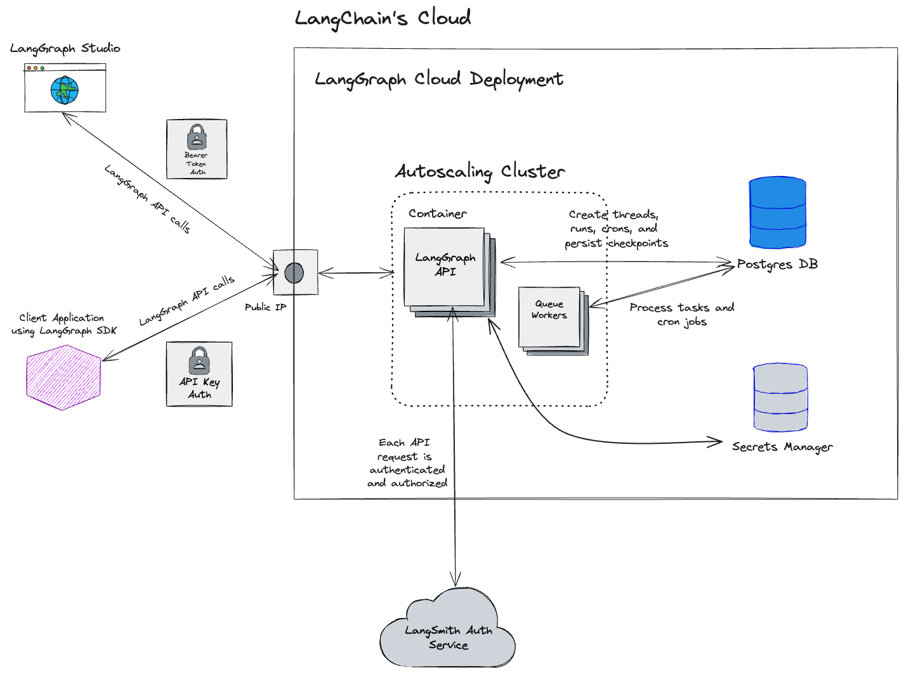

# 云 SaaS

!!! info "前提条件"
    - [LangGraph 平台](./langgraph_platform.md)
    - [LangGraph 服务器](./langgraph_server.md)

## 概述

LangGraph 的云 SaaS 是一种托管服务，用于部署 LangGraph 服务器，无论其定义或依赖关系如何。该服务提供了托管实现的检查点和存储，使您能够专注于为您的用例构建正确的认知架构。通过处理可扩展且安全的基础设施，LangGraph 云 SaaS 提供了将 LangGraph 服务器部署到生产环境的最快路径。

## 部署

**部署** 是 LangGraph 服务器的一个实例。单个部署可以有许多 [修订](#revision)。创建部署时，所有必要的基础设施（例如数据库、容器、密钥存储）都会自动配置。请参阅下面的 [架构图](#architecture) 了解更多细节。

资源分配：

| **部署类型** | **CPU** | **内存** | **扩展**         |
|--------------|---------|----------|------------------|
| 开发         | 1 CPU   | 1 GB     | 最多 1 个容器   |
| 生产         | 2 CPU   | 2 GB     | 最多 10 个容器  |

请参阅 [操作指南](../cloud/deployment/cloud.md#create-new-deployment) 以创建新部署。

## 修订

修订是 [部署](#deployment) 的一个迭代。创建新部署时，会自动创建一个初始修订。要部署新的代码更改或更新部署的环境变量配置，必须创建一个新的修订。创建修订时，会自动构建一个新的容器镜像。

请参阅 [操作指南](../cloud/deployment/cloud.md#create-new-revision) 以创建新修订。

## 持久化

每个部署都会自动创建一个专用数据库。该数据库作为部署的 [持久化层](../concepts/persistence.md)。

在定义要部署到 LangGraph 云 SaaS 的图时，用户不应配置 [检查点](../concepts/persistence.md#checkpointer-libraries)。相反，检查点会自动为图配置。

无法直接访问数据库。所有对数据库的访问都通过 LangGraph 服务器 API 进行。

## 自动扩展
`生产` 类型的部署会自动扩展到最多 10 个容器。扩展基于单个容器的当前请求负载。具体来说，自动扩展实现会扩展部署，以便每个容器处理大约 10 个并发请求。例如...

- 如果部署正在处理 20 个并发请求，部署将从一个容器扩展到两个容器（20 个请求 / 2 个容器 = 每个容器 10 个请求）。
- 如果一个部署有 2 个容器正在处理 10 个请求，部署将从两个容器缩减为一个容器（10 个请求 / 1 个容器 = 每个容器 10 个请求）。

每个容器 10 个并发请求是目标阈值。然而，每个容器 10 个并发请求并不是一个硬性限制。如果请求突然激增，并发请求的数量可能会超过 10。

缩减操作会延迟 30 分钟才会执行。换句话说，如果自动扩展实现决定缩减部署，它会先等待 30 分钟再缩减。30 分钟后，重新计算并发指标，如果并发指标达到目标阈值，部署将缩减。否则，部署保持扩展状态。这个“冷却”期确保部署不会频繁扩展和缩减。

未来，自动扩展实现可能会扩展到适应其他指标，如后台运行队列大小。

## 异步部署

[部署](#deployment) 和 [修订](#revision) 的基础设施是异步配置和部署的。它们不会在提交后立即部署。目前，部署可能需要几分钟时间。

- 创建新部署时，会为该部署创建一个新数据库。数据库创建是一个一次性步骤。这个步骤会延长部署初始修订的部署时间。
- 为部署创建后续修订时，没有数据库创建步骤。后续修订的部署时间显著快于初始修订的部署时间。
- 每个修订的部署过程包含一个构建步骤，可能需要几分钟时间。

## LangSmith 集成

每个部署都会自动创建一个 [LangSmith](https://docs.smith.langchain.com/) 跟踪项目。跟踪项目的名称与部署名称相同。创建部署时，无需指定 `LANGCHAIN_TRACING_V2` 和 `LANGCHAIN_API_KEY` 环境变量；它们会自动内部设置。每个运行的跟踪会自动创建并发送到跟踪项目。

删除部署时，跟踪和跟踪项目不会被删除。

## 自动删除

部署在连续 28 天未使用（处于未使用状态）后会自动删除。如果部署在连续 28 天内没有向 LangSmith 发送跟踪，则该部署处于未使用状态。在任何一天，如果部署向 LangSmith 发送了跟踪，连续未使用的天数计数器将重置。

- 连续 7 天未使用后会发送电子邮件通知。
- 连续 28 天未使用后部署会被删除。

!!! danger "数据无法恢复"
    删除部署后，部署中的数据（即 [持久化](#persistence)）无法恢复。

## 架构

!!! warning "可能会更改"
    云 SaaS 部署架构未来可能会更改。

云 SaaS 部署的高级架构图。

## IP 地址白名单

2025 年 1 月 6 日后创建的 `LangGraph 平台` 部署的所有流量将通过 NAT 网关。
此 NAT 网关将有多个静态 IP 地址，具体取决于您部署的区域。请参阅下表以获取要列入白名单的 IP 地址列表：

| 美国           | 欧洲           |
|----------------|----------------|
| 35.197.29.146  | 34.13.192.67   |
| 34.145.102.123 | 34.147.105.64  |
| 34.169.45.153  | 34.90.22.166   |
| 34.82.222.17   | 34.147.36.213  |
| 35.227.171.135 | 34.32.137.113  |
| 34.169.88.30   | 34.91.238.184  |
| 34.19.93.202   | 35.204.101.241 |
| 34.19.34.50    | 35.204.48.32   |

## 相关

- [部署选项](./deployment_options.md)