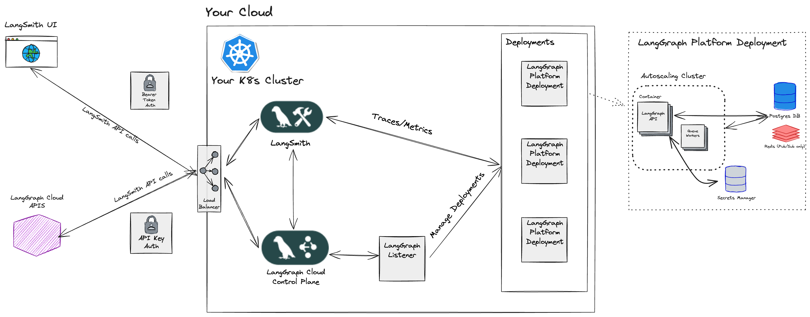

# 自托管控制平面

自托管部署有两个版本：[自托管数据平面](./deployment_options.md#self-hosted-data-plane) 和 [自托管控制平面](./deployment_options.md#self-hosted-control-plane)。

!!! info "重要提示"
    自托管控制平面部署选项需要[企业版](plans.md)计划。

## 需求条件

- 使用`langgraph-cli`和/或[LangGraph Studio](./langgraph_studio.md)应用在本地测试图。
- 使用`langgraph build`命令构建镜像。
- 已部署自托管LangSmith实例。
- 为LangSmith实例使用Ingress。所有代理都将作为Kubernetes服务部署在此Ingress后面。

## 自托管控制平面

[自托管控制平面](./langgraph_self_hosted_control_plane.md)部署选项是一个完全自托管的部署模型，您需要在自己的云中管理[控制平面](./langgraph_control_plane.md)和[数据平面](./langgraph_data_plane.md)。此选项让您完全掌控并负责控制平面和数据平面基础设施。

|                   | [控制平面](../concepts/langgraph_control_plane.md) | [数据平面](../concepts/langgraph_data_plane.md) |
|-------------------|-------------------|------------|
| **是什么？** | <ul><li>用于创建部署和版本的控制平面UI</li><li>用于创建部署和版本的控制平面API</li></ul> | <ul><li>用于与控制平面状态协调部署的数据平面"监听器"</li><li>LangGraph服务器</li><li>Postgres、Redis等</li></ul> |
| **托管在哪里？** | 您的云端 | 您的云端 |
| **由谁配置和管理？** | 您 | 您 |

### 架构

### 计算平台

 - **Kubernetes**：自托管控制平面部署选项支持将控制平面和数据平面基础设施部署到任何Kubernetes集群。

!!! tip
    如需在您的LangSmith实例上启用此功能，请参阅[自托管控制平面部署指南](../cloud/deployment/self_hosted_control_plane.md)。