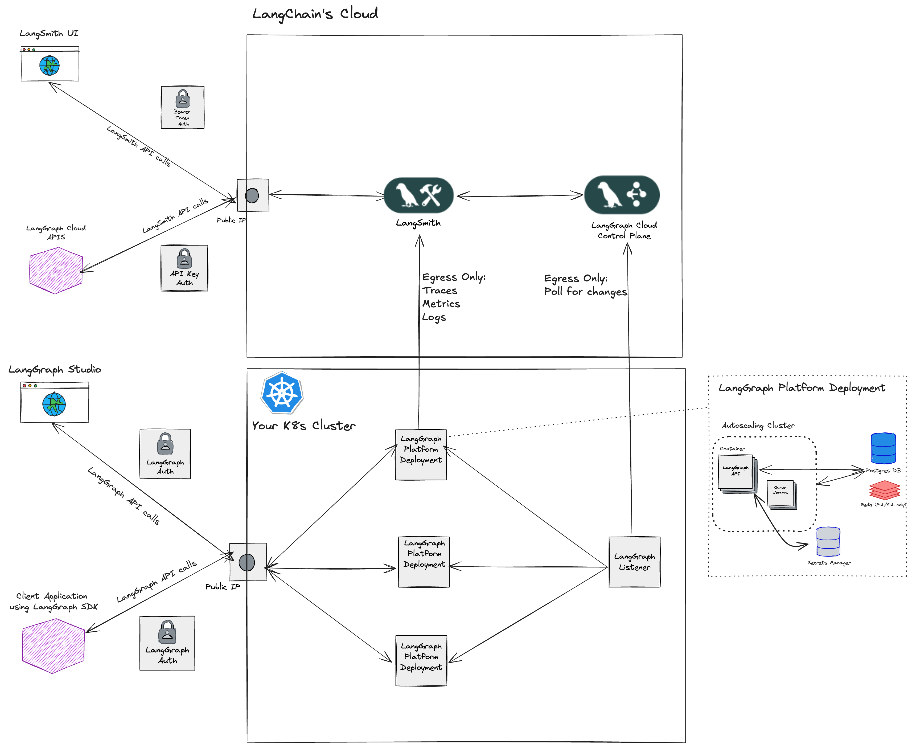

---
search:
  boost: 2
---

# 自托管数据平面

自托管部署有两种版本：[自托管数据平面](./deployment_options.md#self-hosted-data-plane) 和 [自托管控制平面](./deployment_options.md#self-hosted-control-plane)。

!!! info "重要提示"
    自托管数据平面部署方案需要[企业版](plans.md)许可。

## 前提条件

- 使用`langgraph-cli`和/或[LangGraph Studio](./langgraph_studio.md)应用在本地测试图。
- 使用`langgraph build`命令构建镜像。

## 自托管数据平面

[自托管数据平面](../cloud/deployment/self_hosted_data_plane.md)部署方案是一种"混合"部署模式，我们在云端管理[控制平面](./langgraph_control_plane.md)，而您在自己的云端管理[数据平面](./langgraph_data_plane.md)。该方案为您提供了安全管理数据平面基础设施的方式，同时将控制平面管理交由我们负责。使用自托管数据平面版本时，您需要通过[LangSmith](https://smith.langchain.com/) API密钥进行认证。

|                   | [控制平面](../concepts/langgraph_control_plane.md) | [数据平面](../concepts/langgraph_data_plane.md) |
|-------------------|-------------------|------------|
| **是什么？** | <ul><li>用于创建部署和版本的控制平面UI</li><li>用于创建部署和版本的控制平面API</li></ul> | <ul><li>数据平面"监听器"，用于与控制平面状态协调部署</li><li>LangGraph服务器</li><li>Postgres、Redis等</li></ul> |
| **托管在哪里？** | LangChain的云端 | 您的云端 |
| **由谁配置和管理？** | LangChain | 您 |

关于如何将[LangGraph服务器](../concepts/langgraph_server.md)部署到自托管数据平面的信息，请参阅[部署到自托管数据平面](../cloud/deployment/self_hosted_data_plane.md)

### 架构

### 计算平台

- **Kubernetes**：自托管数据平面部署方案支持将数据平面基础设施部署到任何Kubernetes集群。
- **Amazon ECS**：即将推出！

!!! tip
    如果您希望部署到Kubernetes，可以遵循[自托管数据平面部署指南](../cloud/deployment/self_hosted_data_plane.md)。