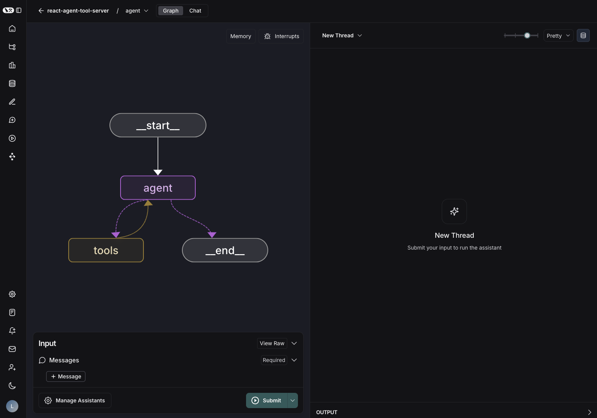

# LangGraph Studio

!!! info "前提条件"

    - [LangGraph 平台](./langgraph_platform.md)
    - [LangGraph 服务器](./langgraph_server.md)

LangGraph Studio 提供了一种新的开发LLM应用程序的方式，通过提供一个专门的代理IDE，实现了对复杂代理应用程序的可视化、交互和调试。

通过可视化图表和状态编辑功能，您可以更好地理解代理的工作流程并加快迭代速度。LangGraph Studio 与 LangSmith 集成，使您能够与团队成员协作调试故障模式。



## 功能

LangGraph Studio 的关键功能包括：

- 可视化您的图表
- 通过UI运行并测试您的图表
- 通过[修改状态并重新运行](human_in_the_loop.md)来调试您的代理
- 创建和管理[助手](assistants.md)
- 查看和管理[线程](persistence.md#threads)
- 查看和管理[长期记忆](memory.md)
- 将节点输入/输出添加到 [LangSmith](https://smith.langchain.com/) 数据集中进行测试

## 入门指南

有两种方式可以将您的LangGraph应用程序与Studio连接：

### 已部署的应用程序

如果您已经将LangGraph应用程序部署在LangGraph平台上，您可以通过该部署访问Studio。为此，请在LangSmith UI中导航到LangGraph平台中的部署，然后点击“LangGraph Studio”按钮。

### 本地开发服务器

如果您有一个[在本地内存中运行](../tutorials/langgraph-platform/local-server.md)的LangGraph应用程序，您可以在LangSmith中的浏览器中将其连接到LangGraph Studio。

默认情况下，使用`langgraph dev`启动本地服务器将在`http://127.0.0.1:2024`运行服务器，并自动在浏览器中打开Studio。但您也可以手动连接到Studio，方法如下：

1. 在LangGraph平台中，点击“LangGraph Studio”按钮，并在出现的对话框中输入服务器URL。

   或

2. 在浏览器中导航到以下URL：

```
https://smith.langchain.com/studio/?baseUrl=http://127.0.0.1:2024
```

## 相关文档

更多信息请参阅以下内容：

- [LangGraph Studio 操作指南](../how-tos/index.md#langgraph-studio)
- [LangGraph CLI 文档](../cloud/reference/cli.md)

## LangGraph Studio 常见问题

### 为什么我的项目无法启动？

如果配置文件定义不正确，或缺少所需的环境变量，项目可能无法启动。请参阅[此处](../cloud/reference/cli.md#configuration-file)了解如何定义您的配置文件。

### 中断是如何工作的？

当您选择`Interrupts`下拉菜单并选择一个节点以中断时，图表将在该节点运行之前和之后（除非该节点直接转到`END`）暂停执行。这意味着您将能够在节点运行之前和之后编辑状态。这旨在为开发者提供更精细的节点行为控制，并使其更容易观察节点的行为方式。如果节点是图表中的最后一个节点，您将无法在节点运行后编辑状态。

有关中断和人工干预的更多信息，请参阅[此处](./human_in_the_loop.md)。

### 为什么我的图表中出现了多余的边？

如果未仔细定义条件边，您可能会注意到图表中出现多余的边。这是因为如果没有正确定义，LangGraph Studio会假定条件边可以访问所有其他节点。为了避免这种情况，您需要明确条件边路由到的节点。有两种方法可以做到这一点：

#### 解决方案1：包含路径映射

第一种解决方法是向条件边添加路径映射。路径映射是一个字典或数组，它将路由器函数的可能输出映射到每个输出对应的节点名称。路径映射作为第三个参数传递给`add_conditional_edges`函数，如下所示：

=== "Python"

    ```python
    graph.add_conditional_edges("node_a", routing_function, {True: "node_b", False: "node_c"})
    ```

=== "Javascript"

    ```ts
    graph.addConditionalEdges("node_a", routingFunction, { true: "node_b", false: "node_c" });
    ```

在这种情况下，路由器函数返回True或False，分别映射到`node_b`和`node_c`。

#### 解决方案2：更新路由器的类型（仅限Python）

您还可以通过使用`Literal` Python定义指定路由器函数可以映射到的节点，明确路由器函数的类型。以下是如何以这种方式定义路由器函数的示例：

```python
def routing_function(state: GraphState) -> Literal["node_b","node_c"]:
    if state['some_condition'] == True:
        return "node_b"
    else:
        return "node_c"
```

### Studio 桌面版常见问题

!!! warning "弃用警告"
    为了支持更广泛的平台和用户，我们现在建议按照上述说明使用开发服务器连接到LangGraph Studio，而不是桌面应用程序。

LangGraph Studio 桌面版应用程序是一个独立的应用程序，允许您连接到您的LangGraph应用程序并可视化和交互您的图表。它仅适用于MacOS，并且需要安装Docker。

#### 为什么我的项目无法启动？

除了上述原因外，对于桌面版应用程序，您的项目可能无法启动的原因还有以下几个：

!!! Important "注意"

    LangGraph Studio 桌面版会自动填充`LANGCHAIN_*`环境变量以进行许可证验证和跟踪，无论`.env`文件的内容如何。`.env`文件中定义的所有其他环境变量都将正常读取。

##### Docker 问题

LangGraph Studio（桌面版）需要Docker Desktop 4.24或更高版本。请确保您安装的Docker版本满足该要求，并且在使用LangGraph Studio之前确保Docker Desktop应用程序已启动并运行。此外，请确保将docker-compose更新到2.22.0或更高版本。

##### 数据区域不正确

如果您在尝试启动LangGraph服务器时收到许可证验证错误，您可能登录了错误的LangSmith数据区域。确保您登录的是正确的LangSmith数据区域，并且该LangSmith帐户有权访问LangGraph平台。

1. 在右上角，点击用户图标并选择`注销`。
1. 在登录屏幕上，点击`数据区域`下拉菜单并选择适当的数据区域。然后点击`登录到LangSmith`。

### 如何重新加载应用程序？

如果您想重新加载应用程序，不要像通常那样使用Command+R。相反，关闭并重新打开应用程序以进行完全刷新。

### 自动重建是如何工作的？

LangGraph Studio的关键功能之一是它在您更改源代码时自动重建您的镜像。这允许超快的开发和测试周期，使您可以轻松地迭代您的图表。LangGraph有两种不同的方式重建您的镜像：要么通过编辑镜像，要么完全重建它。

#### 从源代码更改中重建

如果仅修改了源代码（没有配置或依赖项更改！），则镜像不需要完全重建，LangGraph Studio只会更新相关部分。UI状态将在左下角暂时从`在线`切换到`停止`，同时镜像被编辑。日志将在此过程中显示，镜像编辑完成后，状态将切换回`在线`，您将能够使用修改后的代码运行您的图表！

#### 从配置或依赖项更改中重建

如果您编辑图表配置文件（`langgraph.json`）或依赖项（`pyproject.toml`或`requirements.txt`），则整个镜像将被重建。这将导致UI从图表视图切换，并开始显示新镜像构建过程的日志。这可能需要一两分钟，完成后您的更新镜像将准备就绪！

### 为什么我的图表启动时间这么长？

LangGraph Studio 与本地LangGraph API服务器交互。为了与持续更新保持一致，LangGraph API需要定期重建。因此，您可能会偶尔在启动项目时遇到轻微的延迟。