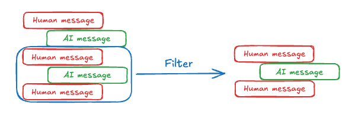

# 记忆

## 什么是记忆？

[记忆](https://pmc.ncbi.nlm.nih.gov/articles/PMC10410470/)是一种认知功能，允许人们存储、检索和使用信息以理解他们的现在和未来。想象一下与一个总是忘记你所说内容的同事一起工作的挫败感，需要不断重复！随着AI代理承担更多涉及大量用户交互的复杂任务，为其配备记忆变得同样重要，以提高效率和用户满意度。有了记忆，代理可以从反馈中学习并适应用户的偏好。本指南涵盖了基于召回范围的两种记忆类型：

**短期记忆**，或[线程](persistence.md#threads)范围内的记忆，可以在与用户的单次对话线程中**随时**召回。LangGraph将短期记忆作为代理[状态](low_level.md#state)的一部分进行管理。状态通过[检查点](persistence.md#checkpoints)持久化到数据库中，因此线程可以随时恢复。短期记忆在调用图或完成步骤时更新，状态在每一步开始时读取。

**长期记忆**在**跨**对话线程之间共享。它可以**在任何时间**和**任何线程**中召回。记忆被限定在任何自定义命名空间中，而不仅仅是在单个线程ID内。LangGraph提供了[存储](persistence.md#memory-store)（[参考文档](https://langchain-ai.github.io/langgraph/reference/store/#langgraph.store.base.BaseStore)）来保存和召回长期记忆。

两者对于理解和实现您的应用程序都非常重要。


## 短期记忆

短期记忆让您的应用程序能够记住单个[线程](persistence.md#threads)或对话中的先前交互。[线程](persistence.md#threads)组织会话中的多个交互，类似于电子邮件将消息分组到单个对话中的方式。

LangGraph将短期记忆作为代理状态的一部分进行管理，通过线程范围的检查点持久化。此状态通常包括对话历史记录以及其他有状态数据，例如上传的文件、检索的文档或生成的工件。通过将这些存储在图的状态中，机器人可以访问给定对话的完整上下文，同时保持不同线程之间的分离。

由于对话历史记录是表示短期记忆的最常见形式，在下一节中，我们将介绍在消息列表变得**很长**时管理对话历史记录的技术。如果您想坚持高层次的概念，请继续阅读[长期记忆](#long-term-memory)部分。

### 管理长对话历史记录

长对话对当今的LLM提出了挑战。完整的历史记录可能甚至无法放入LLM的上下文窗口中，导致不可恢复的错误。即使您的LLM技术上支持完整的上下文长度，大多数LLM在长上下文中的表现仍然不佳。它们会被过时或离题的内容“分心”，同时响应时间变慢，成本增加。

管理短期记忆是平衡[精确度和召回率](https://en.wikipedia.org/wiki/Precision_and_recall#:~:text=Precision%20can%20be%20seen%20as,irrelevant%20ones%20are%20also%20returned)与应用程序其他性能要求（延迟和成本）的练习。与往常一样，重要的是要批判性地思考如何为您的LLM表示信息，并查看您的数据。我们在下面介绍了几种管理消息列表的常见技术，并希望为您提供足够的上下文，以便为您的应用程序选择最佳权衡：

- [编辑消息列表](#editing-message-lists)：在传递给语言模型之前，如何考虑修剪和过滤消息列表。
- [总结过去的对话](#summarizing-past-conversations)：当您不想仅仅过滤消息列表时，这是一种常见的技术。

### 编辑消息列表

聊天模型使用[消息](https://python.langchain.com/docs/concepts/#messages)接受上下文，其中包括开发人员提供的指令（系统消息）和用户输入（人类消息）。在聊天应用程序中，消息在人类输入和模型响应之间交替，导致消息列表随着时间的推移变得越来越长。由于上下文窗口有限，且消息列表的令牌丰富，许多应用程序可以通过使用技术手动删除或忘记过时信息而受益。



最直接的方法是从列表中删除旧消息（类似于[最近最少使用缓存](https://en.wikipedia.org/wiki/Page_replacement_algorithm#Least_recently_used)）。

在LangGraph中从列表中删除内容的典型技术是从节点返回更新，告诉系统删除列表的某些部分。您可以定义此更新的外观，但常见的方法是让您返回一个对象或字典，指定要保留的值。

```python
def manage_list(existing: list, updates: Union[list, dict]):
    if isinstance(updates, list):
        # 正常情况，添加到历史记录中
        return existing + updates
    elif isinstance(updates, dict) and updates["type"] == "keep":
        # 您可以决定这是什么样子。
        # 例如，您可以简化并只接受字符串“DELETE”
        # 并清除整个列表。
        return existing[updates["from"]:updates["to"]]
    # 等等。我们定义如何解释更新

class State(TypedDict):
    my_list: Annotated[list, manage_list]

def my_node(state: State):
    return {
        # 我们为字段“my_list”返回一个更新，表示
        # 只保留从索引-5到末尾的值（删除其余部分）
        "my_list": {"type": "keep", "from": -5, "to": None}
    }
```

LangGraph将在“my_list”键下返回更新时调用`manage_list`“[reducer](low_level.md#reducers)”函数。在该函数中，我们定义接受哪些类型的更新。通常，消息将添加到现有列表中（对话将增长）；但是，我们还添加了支持，以接受一个字典，让您“保留”状态的某些部分。这使您可以以编程方式删除旧消息上下文。

另一种常见的方法是让您返回一个“remove”对象列表，指定要删除的所有消息的ID。如果您使用LangChain消息和LangGraph中的[`add_messages`](https://langchain-ai.github.io/langgraph/reference/graphs/#langgraph.graph.message.add_messages) reducer（或使用相同底层功能的`MessagesState`），您可以使用`RemoveMessage`执行此操作。

```python
from langchain_core.messages import RemoveMessage, AIMessage
from langgraph.graph import add_messages
# ... 其他导入

class State(TypedDict):
    # add_messages 默认将消息按ID插入到现有列表中
    # 如果返回了RemoveMessage，它将按ID删除列表中的消息
    messages: Annotated[list, add_messages]

def my_node_1(state: State):
    # 向状态中的`messages`列表添加一个AI消息
    return {"messages": [AIMessage(content="Hi")]}

def my_node_2(state: State):
    # 从状态中的`messages`列表中删除除最后2条消息之外的所有消息
    delete_messages = [RemoveMessage(id=m.id) for m in state['messages'][:-2]]
    return {"messages": delete_messages}

```

在上面的示例中，`add_messages` reducer允许我们[追加](https://langchain-ai.github.io/langgraph/concepts/low_level/#serialization)新消息到`messages`状态键，如`my_node_1`所示。当它看到`RemoveMessage`时，它将从列表中删除具有该ID的消息（然后RemoveMessage将被丢弃）。有关LangChain特定消息处理的更多信息，请查看[此如何使用`RemoveMessage`](https://langchain-ai.github.io/langgraph/how-tos/memory/delete-messages/)的指南。

请参阅此[指南](https://langchain-ai.github.io/langgraph/how-tos/memory/manage-conversation-history/)和我们[LangChain Academy](https://github.com/langchain-ai/langchain-academy/tree/main/module-2)课程中的模块2以获取示例用法。

### 总结过去的对话

如上所示，修剪或删除消息的问题在于，我们可能会从消息队列的裁剪中丢失信息。因此，一些应用程序受益于使用聊天模型总结消息历史的更复杂方法。


简单的提示和编排逻辑可以实现这一点。例如，在LangGraph中，我们可以扩展[MessagesState](https://langchain-ai.github.io/langgraph/concepts/low_level/#working-with-messages-in-graph-state)以包括一个`summary`键。

```python
from langgraph.graph import MessagesState
class State(MessagesState):
    summary: str
```

然后，我们可以生成聊天历史的摘要，使用任何现有的摘要作为下一个摘要的上下文。在`messages`状态键中积累了一些消息后，可以调用此`summarize_conversation`节点。

```python
def summarize_conversation(state: State):

    # 首先，我们获取任何现有的摘要
    summary = state.get("summary", "")

    # 创建我们的摘要提示
    if summary:

        # 已经存在摘要
        summary_message = (
            f"这是迄今为止对话的摘要：{summary}\n\n"
            "通过考虑上面的新消息来扩展摘要："
        )

    else:
        summary_message = "创建上面对话的摘要："

    # 将提示添加到我们的历史记录中
    messages = state["messages"] + [HumanMessage(content=summary_message)]
    response = model.invoke(messages)

    # 删除除最后2条消息之外的所有消息
    delete_messages = [RemoveMessage(id=m.id) for m in state["messages"][:-2]]
    return {"summary": response.content, "messages": delete_messages}
```

请参阅此[指南](https://langchain-ai.github.io/langgraph/how-tos/memory/add-summary-conversation-history/)和我们[LangChain Academy](https://github.com/langchain-ai/langchain-academy/tree/main/module-2)课程中的模块2以获取示例用法。

### 知道**何时**删除消息

大多数LLM都有一个最大支持的上下文窗口（以令牌为单位）。决定何时截断消息的一个简单方法是计算消息历史记录中的令牌，并在接近该限制时截断。尽管存在一些“陷阱”，但天真的截断很容易自己实现。一些模型API进一步限制了消息类型的顺序（必须以人类消息开头，不能有连续的同类型消息等）。如果您使用LangChain，您可以使用[`trim_messages`](https://python.langchain.com/docs/how_to/trim_messages/#trimming-based-on-token-count)实用程序，并指定要从列表中保留的令牌数量，以及用于处理边界的`strategy`（例如，保留最后`max_tokens`）。

以下是一个示例。

```python
from langchain_core.messages import trim_messages
trim_messages(
    messages,
    # 保留消息的最后<= n_count个令牌。
    strategy="last",
    # 记住根据您的模型进行调整
    # 或者传递一个自定义的token_encoder
    token_counter=ChatOpenAI(model="gpt-4"),
    # 记住根据所需的对话长度进行调整
    max_tokens=45,
    # 大多数聊天模型期望聊天历史以以下之一开头：
    # (1) 一个HumanMessage或
    # (2) 一个SystemMessage后跟一个HumanMessage
    start_on="human",
    # 大多数聊天模型期望聊天历史以以下之一结尾：
    # (1) 一个HumanMessage或
    # (2) 一个ToolMessage
    end_on=("human", "tool"),
    # 通常，我们希望保留SystemMessage
    # 如果它存在于原始历史记录中。
    # SystemMessage包含模型的特殊指令。
    include_system=True,
)
```

## 长期记忆

LangGraph中的长期记忆允许系统在不同的对话或会话之间保留信息。与**线程范围**的短期记忆不同，长期记忆保存在自定义“命名空间”中。

### 存储记忆

LangGraph将长期记忆作为JSON文档存储在[存储](persistence.md#memory-store)中（[参考文档](https://langchain-ai.github.io/langgraph/reference/store/#langgraph.store.base.BaseStore)）。每个记忆都组织在一个自定义的`namespace`（类似于文件夹）和一个独特的`key`（类似于文件名）下。命名空间通常包括用户或组织ID或其他标签，以便更容易地组织信息。这种结构使得记忆的分层组织成为可能。然后通过内容过滤器支持跨命名空间的搜索。请参阅下面的示例。

```python
from langgraph.store.memory import InMemoryStore


def embed(texts: list[str]) -> list[list[float]]:
    # 替换为实际的嵌入函数或LangChain嵌入对象
    return [[1.0, 2.0] * len(texts)]


# InMemoryStore将数据保存到内存中的字典中。在生产环境中使用数据库支持的存储。
store = InMemoryStore(index={"embed": embed, "dims": 2})
user_id = "my-user"
application_context = "chitchat"
namespace = (user_id, application_context)
store.put(
    namespace,
    "a-memory",
    {
        "rules": [
            "User likes short, direct language",
            "User only speaks English & python",
        ],
        "my-key": "my-value",
    },
)
# 通过ID获取“记忆”
item = store.get(namespace, "a-memory")
# 在此命名空间内搜索“记忆”，按内容等价性过滤，按向量相似性排序
items = store.search(
    namespace, filter={"my-key": "my-value"}, query="language preferences"
)
```

### 长期记忆的思考框架

长期记忆是一个复杂的挑战，没有一刀切的解决方案。然而，以下问题提供了一个结构框架，帮助您导航不同的技术：

**记忆的类型是什么？**

人类使用记忆来记住[事实](https://en.wikipedia.org/wiki/Semantic_memory)、[经验](https://en.wikipedia.org/wiki/Episodic_memory)和[规则](https://en.wikipedia.org/wiki/Procedural_memory)。AI代理可以以相同的方式使用记忆。例如，AI代理可以使用记忆来记住关于用户的特定事实以完成任务。我们在[下面的部分](#memory-types)中扩展了几种记忆类型。

**您希望何时更新记忆？**

记忆可以作为代理应用程序逻辑的一部分进行更新（例如，“在热路径上”）。在这种情况下，代理通常在响应用户之前决定记住事实。或者，记忆可以作为后台任务更新（在后台/异步运行并生成记忆的逻辑）。我们在[下面的部分](#writing-memories)中解释了这些方法之间的权衡。

## 记忆类型

不同的应用程序需要各种类型的记忆。尽管类比并不完美，但研究[人类记忆类型](https://www.psychologytoday.com/us/basics/memory/types-of-memory?ref=blog.langchain.dev)可以很有见地。一些研究（例如，[CoALA论文](https://arxiv.org/pdf/2309.02427)）甚至将这些人类记忆类型映射到AI代理中使用的记忆类型。

| 记忆类型 | 存储内容 | 人类示例 | 代理示例 |
|-------------|----------------|---------------|---------------|
| 语义 | 事实 | 我在学校学到的东西 | 关于用户的事实 |
| 情景 | 经验 | 我做过的事情 | 过去的代理行为 |
| 程序 | 指令 | 本能或运动技能 | 代理系统提示 |

### 语义记忆

[语义记忆](https://en.wikipedia.org/wiki/Semantic_memory)，无论是在人类还是AI代理中，都涉及特定事实和概念的保留。在人类中，它可以包括在学校学到的信息以及对概念及其关系的理解。对于AI代理，语义记忆通常用于通过记住过去交互中的事实或概念来个性化应用程序。

> 注意：不要与“语义搜索”混淆，后者是一种使用“意义”（通常作为嵌入）查找相似内容的技术。语义记忆是心理学中的一个术语，指的是存储事实和知识，而语义搜索是一种基于意义而不是精确匹配检索信息的方法。

#### 个人资料

语义记忆可以以不同的方式管理。例如，记忆可以是一个单一的、不断更新的“个人资料”，包含关于用户、组织或其他实体（包括代理本身）的明确和具体的信息。个人资料通常只是一个JSON文档，包含您选择表示您的域的各种键值对。

当记住个人资料时，您需要确保每次都在**更新**个人资料。因此，您需要传入先前的个人资料，并[要求模型生成一个新的个人资料](https://github.com/langchain-ai/memory-template)（或一些[JSON补丁](https://github.com/hinthornw/trustcall)以应用于旧个人资料）。随着个人资料变得越来越大，这可能会变得容易出错，并且可能受益于将个人资料拆分为多个文档或在生成文档时进行**严格**解码，以确保记忆模式保持有效。


#### 集合

或者，记忆可以是一个不断更新和扩展的文档集合。每个单独的记忆可以更狭窄地限定范围，更容易生成，这意味着您不太可能**丢失**信息。对于LLM来说，为新信息生成_新_对象比将新信息与现有个人资料协调更容易。因此，文档集合往往会导致[更高的下游召回率](https://en.wikipedia.org/wiki/Precision_and_recall)。

然而，这会将一些复杂性转移到记忆更新上。模型现在必须_删除_或_更新_列表中的现有项目，这可能会很棘手。此外，一些模型可能默认过度插入，而其他模型可能默认过度更新。请参阅[Trustcall](https://github.com/hinthornw/trustcall)包以了解一种管理此问题的方法，并考虑评估（例如，使用[LangSmith](https://docs.smith.langchain.com/tutorials/Developers/evaluation)等工具）以帮助您调整行为。

使用文档集合还会将复杂性转移到记忆**搜索**上。`Store`目前支持[语义搜索](https://langchain-ai.github.io/langgraph/reference/store/#langgraph.store.base.SearchOp.query)和[按内容过滤](https://langchain-ai.github.io/langgraph/reference/store/#langgraph.store.base.SearchOp.filter)。

最后，使用记忆集合可能会使模型难以提供全面的上下文。虽然单个记忆可能遵循特定的模式，但这种结构可能无法捕捉记忆之间的完整上下文或关系。因此，当使用这些记忆生成响应时，模型可能会缺乏在统一个人资料方法中更容易获得的重要上下文信息。


无论采用哪种记忆管理方法，核心点是代理将使用语义记忆来[锚定其响应](https://python.langchain.com/docs/concepts/rag/)，这通常会导致更个性化和相关的交互。

### 情景记忆

[情景记忆](https://en.wikipedia.org/wiki/Episodic_memory)，无论是在人类还是AI代理中，都涉及回忆过去的事件或行为。[CoALA论文](https://arxiv.org/pdf/2309.02427)很好地阐述了这一点：事实可以写入语义记忆，而*经验*可以写入情景记忆。对于AI代理，情景记忆通常用于帮助代理记住如何完成任务。

在实践中，情景记忆通常通过[少样本示例提示](https://python.langchain.com/docs/concepts/few_shot_prompting/)实现，其中代理从过去的序列中学习以正确执行任务。有时“展示”比“讲述”更容易，LLM从示例中学习得很好。少样本学习让您通过更新提示中的输入输出示例来说明预期行为来[“