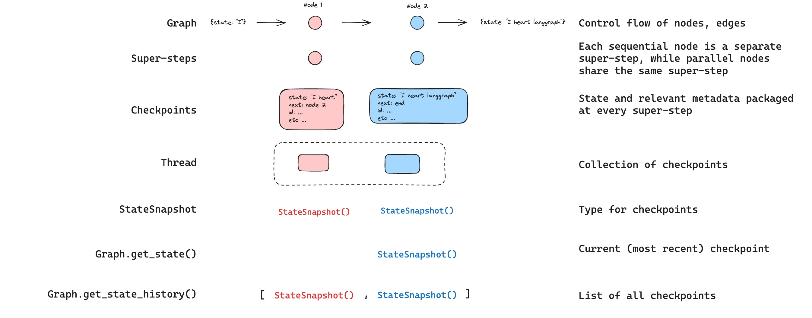

# 持久性

LangGraph 内置了一个持久层，通过检查点器实现。当你使用检查点器编译图时，检查点器会在每个超级步骤保存图状态的`检查点`。这些检查点被保存到一个`线程`中，可以在图执行后访问。由于`线程`允许在执行后访问图的状态，因此包括人在回路、记忆、时间旅行和容错在内的多种强大功能都成为可能。请参阅[此操作指南](../how-tos/persistence.ipynb)以了解如何为你的图添加和使用检查点器的端到端示例。下面，我们将详细讨论这些概念。


## 线程

线程是由检查点器保存的每个检查点的唯一ID或[线程标识符](#threads)。当使用检查点器调用图时，你**必须**在配置的`configurable`部分指定一个`thread_id`：

```python
{"configurable": {"thread_id": "1"}}
```

## 检查点

检查点是每个超级步骤保存的图状态的快照，由`StateSnapshot`对象表示，具有以下关键属性：

- `config`：与此检查点关联的配置。
- `metadata`：与此检查点关联的元数据。
- `values`：此时状态通道的值。
- `next`：图中接下来要执行的节点名称的元组。
- `tasks`：包含有关接下来要执行的任务信息的`PregelTask`对象元组。如果该步骤之前尝试过，它将包含错误信息。如果图从节点内部[动态](../how-tos/human_in_the_loop/dynamic_breakpoints.ipynb)中断，任务将包含与中断相关的附加数据。

让我们看看当调用一个简单的图时保存了哪些检查点：

```python
from langgraph.graph import StateGraph, START, END
from langgraph.checkpoint.memory import MemorySaver
from typing import Annotated
from typing_extensions import TypedDict
from operator import add

class State(TypedDict):
    foo: str
    bar: Annotated[list[str], add]

def node_a(state: State):
    return {"foo": "a", "bar": ["a"]}

def node_b(state: State):
    return {"foo": "b", "bar": ["b"]}


workflow = StateGraph(State)
workflow.add_node(node_a)
workflow.add_node(node_b)
workflow.add_edge(START, "node_a")
workflow.add_edge("node_a", "node_b")
workflow.add_edge("node_b", END)

checkpointer = MemorySaver()
graph = workflow.compile(checkpointer=checkpointer)

config = {"configurable": {"thread_id": "1"}}
graph.invoke({"foo": ""}, config)
```

运行图后，我们预计会看到恰好4个检查点：

* 空检查点，`START`为下一个要执行的节点
* 带有用户输入`{'foo': '', 'bar': []}`的检查点，`node_a`为下一个要执行的节点
* 带有`node_a`输出`{'foo': 'a', 'bar': ['a']}`的检查点，`node_b`为下一个要执行的节点
* 带有`node_b`输出`{'foo': 'b', 'bar': ['a', 'b']}`的检查点，没有下一个要执行的节点

注意，`bar`通道的值包含来自两个节点的输出，因为我们为`bar`通道定义了一个归约器。

### 获取状态

与保存的图状态交互时，你**必须**指定一个[线程标识符](#threads)。你可以通过调用`graph.get_state(config)`查看图的*最新*状态。这将返回一个`StateSnapshot`对象，该对象对应于配置中提供的线程ID的最新检查点，或者如果提供了线程的检查点ID，则对应于该检查点。

```python
# 获取最新的状态快照
config = {"configurable": {"thread_id": "1"}}
graph.get_state(config)

# 获取特定checkpoint_id的状态快照
config = {"configurable": {"thread_id": "1", "checkpoint_id": "1ef663ba-28fe-6528-8002-5a559208592c"}}
graph.get_state(config)
```

在我们的示例中，`get_state`的输出将如下所示：

```
StateSnapshot(
    values={'foo': 'b', 'bar': ['a', 'b']},
    next=(),
    config={'configurable': {'thread_id': '1', 'checkpoint_ns': '', 'checkpoint_id': '1ef663ba-28fe-6528-8002-5a559208592c'}},
    metadata={'source': 'loop', 'writes': {'node_b': {'foo': 'b', 'bar': ['b']}}, 'step': 2},
    created_at='2024-08-29T19:19:38.821749+00:00',
    parent_config={'configurable': {'thread_id': '1', 'checkpoint_ns': '', 'checkpoint_id': '1ef663ba-28f9-6ec4-8001-31981c2c39f8'}}, tasks=()
)
```

### 获取状态历史

你可以通过调用`graph.get_state_history(config)`获取给定线程的图执行完整历史。这将返回与配置中提供的线程ID关联的`StateSnapshot`对象列表。重要的是，检查点将按时间顺序排列，最新的检查点/`StateSnapshot`在列表的第一个位置。

```python
config = {"configurable": {"thread_id": "1"}}
list(graph.get_state_history(config))
```

在我们的示例中，`get_state_history`的输出将如下所示：

```
[
    StateSnapshot(
        values={'foo': 'b', 'bar': ['a', 'b']},
        next=(),
        config={'configurable': {'thread_id': '1', 'checkpoint_ns': '', 'checkpoint_id': '1ef663ba-28fe-6528-8002-5a559208592c'}},
        metadata={'source': 'loop', 'writes': {'node_b': {'foo': 'b', 'bar': ['b']}}, 'step': 2},
        created_at='2024-08-29T19:19:38.821749+00:00',
        parent_config={'configurable': {'thread_id': '1', 'checkpoint_ns': '', 'checkpoint_id': '1ef663ba-28f9-6ec4-8001-31981c2c39f8'}},
        tasks=(),
    ),
    StateSnapshot(
        values={'foo': 'a', 'bar': ['a']}, next=('node_b',),
        config={'configurable': {'thread_id': '1', 'checkpoint_ns': '', 'checkpoint_id': '1ef663ba-28f9-6ec4-8001-31981c2c39f8'}},
        metadata={'source': 'loop', 'writes': {'node_a': {'foo': 'a', 'bar': ['a']}}, 'step': 1},
        created_at='2024-08-29T19:19:38.819946+00:00',
        parent_config={'configurable': {'thread_id': '1', 'checkpoint_ns': '', 'checkpoint_id': '1ef663ba-28f4-6b4a-8000-ca575a13d36a'}},
        tasks=(PregelTask(id='6fb7314f-f114-5413-a1f3-d37dfe98ff44', name='node_b', error=None, interrupts=()),),
    ),
    StateSnapshot(
        values={'foo': '', 'bar': []},
        next=('node_a',),
        config={'configurable': {'thread_id': '1', 'checkpoint_ns': '', 'checkpoint_id': '1ef663ba-28f4-6b4a-8000-ca575a13d36a'}},
        metadata={'source': 'loop', 'writes': None, 'step': 0},
        created_at='2024-08-29T19:19:38.817813+00:00',
        parent_config={'configurable': {'thread_id': '1', 'checkpoint_ns': '', 'checkpoint_id': '1ef663ba-28f0-6c66-bfff-6723431e8481'}},
        tasks=(PregelTask(id='f1b14528-5ee5-579c-949b-23ef9bfbed58', name='node_a', error=None, interrupts=()),),
    ),
    StateSnapshot(
        values={'bar': []},
        next=('__start__',),
        config={'configurable': {'thread_id': '1', 'checkpoint_ns': '', 'checkpoint_id': '1ef663ba-28f0-6c66-bfff-6723431e8481'}},
        metadata={'source': 'input', 'writes': {'foo': ''}, 'step': -1},
        created_at='2024-08-29T19:19:38.816205+00:00',
        parent_config=None,
        tasks=(PregelTask(id='6d27aa2e-d72b-5504-a36f-8620e54a76dd', name='__start__', error=None, interrupts=()),),
    )
]
```



### 重放

也可以重放先前的图执行。如果我们使用`thread_id`和`checkpoint_id`调用图，那么我们将*重放*在对应于`checkpoint_id`的检查点之前执行的步骤，并且只执行检查点之后的步骤。

* `thread_id`是线程的ID。
* `checkpoint_id`是指向线程中特定检查点的标识符。

你必须在调用图时将这些作为配置的`configurable`部分传递：

```python
config = {"configurable": {"thread_id": "1", "checkpoint_id": "0c62ca34-ac19-445d-bbb0-5b4984975b2a"}}
graph.invoke(None, config=config)
```

重要的是，LangGraph知道某个步骤是否之前执行过。如果执行过，LangGraph只是*重放*图中的该特定步骤，并且不会重新执行该步骤，但仅针对提供的`checkpoint_id`之前的步骤。`checkpoint_id`之后的所有步骤都将被执行（即一个新的分支），即使它们之前已经执行过。请参阅此[时间旅行操作指南以了解更多关于重放的信息](../how-tos/human_in_the_loop/time-travel.ipynb)。


### 更新状态

除了从特定`检查点`重放图之外，我们还可以*编辑*图状态。我们使用`graph.update_state()`来实现这一点。该方法接受三个不同的参数：

#### `config`

配置应包含指定要更新哪个线程的`thread_id`。当仅传递`thread_id`时，我们更新（或分支）当前状态。可选地，如果我们包含`checkpoint_id`字段，那么我们将分支到选定的检查点。

#### `values`

这些是用于更新状态的值。请注意，此更新与来自节点的任何更新一样处理。这意味着这些值将传递给[归约器](./low_level.md#reducers)函数，如果它们为图中的某些通道定义了归约器。这意味着`update_state`不会自动覆盖每个通道的通道值，而只会覆盖没有归约器的通道。让我们通过一个示例来了解。

假设你定义了图的状态，其模式如下（参见上面的完整示例）：

```python
from typing import Annotated
from typing_extensions import TypedDict
from operator import add

class State(TypedDict):
    foo: int
    bar: Annotated[list[str], add]
```

现在假设图的当前状态是

```
{"foo": 1, "bar": ["a"]}
```

如果你按如下方式更新状态：

```
graph.update_state(config, {"foo": 2, "bar": ["b"]})
```

那么图的新状态将是：

```
{"foo": 2, "bar": ["a", "b"]}
```

`foo`键（通道）完全更改（因为该通道没有指定归约器，所以`update_state`会覆盖它）。然而，`bar`键指定了归约器，因此它将`"b"`附加到`bar`的状态。

#### `as_node`

调用`update_state`时可以可选指定的最后一件事是`as_node`。如果你提供了它，更新将应用为好像它来自节点`as_node`。如果未提供`as_node`，它将设置为最后更新状态的节点，如果不模糊。这很重要，因为接下来要执行的步骤取决于最后给出更新的节点，因此这可以用于控制哪个节点接下来执行。请参阅此[时间旅行操作指南以了解更多关于分支状态的信息](../how-tos/human_in_the_loop/time-travel.ipynb)。


## 内存存储


[状态模式](low_level.md#schema)指定了一组键，这些键在图执行时被填充。如上所述，状态可以由检查点器在每个图步骤保存到线程，从而实现状态持久性。

但是，如果我们想要在*线程之间*保留一些信息呢？考虑一个聊天机器人的情况，我们希望在所有与该用户的聊天对话（即线程）中保留关于该用户的特定信息！

仅使用检查点器，我们无法在线程之间共享信息。这促使我们需要[`Store`](../reference/store.md#langgraph.store.base.BaseStore)接口。作为说明，我们可以定义一个`InMemoryStore`来存储关于用户在线程之间的信息。我们像以前一样使用检查点器编译我们的图，并使用我们的新`in_memory_store`变量。

### 基本用法

首先，让我们在不使用LangGraph的情况下单独展示这一点。

```python
from langgraph.store.memory import InMemoryStore
in_memory_store = InMemoryStore()
```

内存通过`tuple`进行命名空间，在这个特定示例中将是`(<user_id>, "memories")`。命名空间可以是任何长度并代表任何内容，不一定是用户特定的。

```python 
user_id = "1"
namespace_for_memory = (user_id, "memories")
```

我们使用`store.put`方法将内存保存到我们命名空间中的存储中。当我们这样做时，我们指定命名空间，如上所述，以及内存的键值对：键是内存的唯一标识符（`memory_id`），值（字典）是内存本身。

```python
memory_id = str(uuid.uuid4())
memory = {"food_preference" : "I like pizza"}
in_memory_store.put(namespace_for_memory, memory_id, memory)
```

我们可以使用`store.search`方法读取我们命名空间中的内存，这将返回给定用户的所有内存作为列表。最近的内存是列表中的最后一个。

```python
memories = in_memory_store.search(namespace_for_memory)
memories[-1].dict()
{'value': {'food_preference': 'I like pizza'},
 'key': '07e0caf4-1631-47b7-b15f-65515d4c1843',
 'namespace': ['1', 'memories'],
 'created_at': '2024-10-02T17:22:31.590602+00:00',
 'updated_at': '2024-10-02T17:22:31.590605+00:00'}
```

每种内存类型都是一个Python类（[`Item`](https://langchain-ai.github.io/langgraph/reference/store/#langgraph.store.base.Item)），具有某些属性。我们可以通过`.dict`将其转换为字典来访问它，如上所示。
它具有的属性是：

- `value`：此内存的值（本身是一个字典）
- `key`：此命名空间中此内存的唯一键
- `namespace`：字符串列表，此内存类型的命名空间
- `created_at`：此内存创建时的时间戳
- `updated_at`：此内存更新时的时间戳

### 语义搜索

除了简单的检索，存储还支持语义搜索，允许你根据含义而不是精确匹配来查找内存。要启用此功能，请使用嵌入模型配置存储：

```python
from langchain.embeddings import init_embeddings

store = InMemoryStore(
    index={
        "embed": init_embeddings("openai:text-embedding-3-small"),  # 嵌入提供者
        "dims": 1536,                              # 嵌入维度
        "fields": ["food_preference", "$"]              # 要嵌入的字段
    }
)
```

现在在搜索时，你可以使用自然语言查询来查找相关内存：

```python
# 查找关于食物偏好的内存
# （这可以在将内存放入存储后完成）
memories = store.search(
    namespace_for_memory,
    query="用户喜欢吃什么？",
    limit=3  # 返回前3个匹配项
)
```

你可以通过配置`fields`参数或在存储内存时指定`index`参数来控制内存的哪些部分被嵌入：

```python
# 使用特定字段存储嵌入
store.put(
    namespace_for_memory,
    str(uuid.uuid4()),
    {
        "food_preference": "我喜欢意大利菜",
        "context": "讨论晚餐计划"
    },
    index=["food_preference"]  # 仅嵌入"food_preferences"字段
)

# 不嵌入存储（仍然可检索，但不可搜索）
store.put(
    namespace_for_memory,
    str(uuid.uuid4()),
    {"system_info": "最后更新：2024-01-01"},
    index=False
)
```

### 在LangGraph中使用

有了这一切，我们在LangGraph中使用`in_memory_store`。`in_memory_store`与检查点器协同工作：检查点器将状态保存到线程，如上所述，而`in_memory_store`允许我们存储任意信息以在*线程之间*访问。我们使用检查点器和`in_memory_store`编译图，如下所示。

```python
from langgraph.checkpoint.memory import MemorySaver

# 我们需要这个，因为我们希望启用线程（对话）
checkpointer = MemorySaver()

# ... 定义图 ...

# 使用检查点器和存储编译图
graph = graph.compile(checkpointer=checkpointer, store=in_memory_store)
```

我们像以前一样使用`thread_id`调用图，并且还使用`user_id`，我们将使用它来将此特定用户的内存命名空间，如上所示。

```python
# 调用图
user_id = "1"
config = {"configurable": {"thread_id": "1", "user_id": user_id}}

# 首先让我们向AI打个招呼
for update in graph.stream(
    {"messages": [{"role": "user", "content": "hi"}]}, config, stream_mode="updates"
):
    print(update)
```

我们可以在*任何节点*中访问