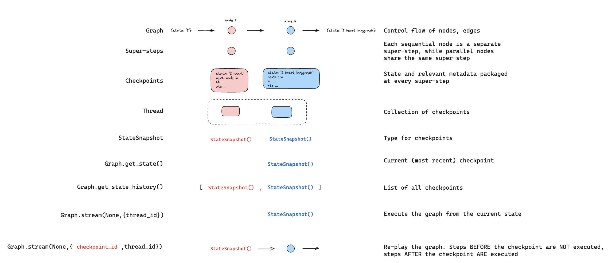
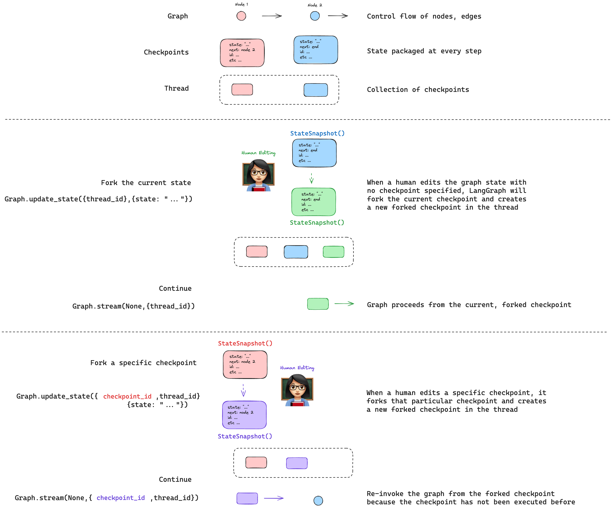

# 时间旅行 ⏱️

!!! note "前提条件"

    本指南假设您熟悉 LangGraph 的检查点和状态。如果不熟悉，请先复习[持久性](./persistence.md)概念。

在处理基于模型做出决策的非确定性系统（例如，由 LLM 驱动的代理）时，详细检查其决策过程非常有用：

1. 🤔 **理解推理**：分析导致成功结果的步骤。
2. 🐞 **调试错误**：识别错误发生的位置和原因。
3. 🔍 **探索替代方案**：测试不同的路径以发现更好的解决方案。

我们称这些调试技术为**时间旅行**，由两个关键操作组成：[**重放**](#replaying) 🔁 和 [**分叉**](#forking) 🔀 。

## 重放



重放允许我们回顾并重现代理过去的操作，直至并包括特定步骤（检查点）。

要重放特定检查点之前的操作，首先检索该线程的所有检查点：

```python
all_checkpoints = []
for state in graph.get_state_history(thread):
    all_checkpoints.append(state)
```

每个检查点都有一个唯一的 ID。在确定所需的检查点（例如，`xyz`）后，将其 ID 包含在配置中：

```python
config = {'configurable': {'thread_id': '1', 'checkpoint_id': 'xyz'}}
for event in graph.stream(None, config, stream_mode="values"):
    print(event)
```

图形将重放之前执行的步骤 _在_ 提供的 `checkpoint_id` 之前，并执行 `checkpoint_id` _之后_ 的步骤（即一个新的分叉），即使它们之前已经执行过。

## 分叉



分叉允许您回顾代理过去的操作，并在图形中探索替代路径。

要编辑特定检查点（例如，`xyz`），在更新图形状态时提供其 `checkpoint_id`：

```python
config = {"configurable": {"thread_id": "1", "checkpoint_id": "xyz"}}
graph.update_state(config, {"state": "updated state"})
```

这将创建一个新的分叉检查点 `xyz-fork`，您可以从中继续运行图形：

```python
config = {'configurable': {'thread_id': '1', 'checkpoint_id': 'xyz-fork'}}
for event in graph.stream(None, config, stream_mode="values"):
    print(event)
```

## 附加资源 📚

- [**概念指南：持久性**](https://langchain-ai.github.io/langgraph/concepts/persistence/#replay)：阅读持久性指南以获取更多关于重放的背景信息。
- [**如何查看和更新过去的图形状态**](../how-tos/human_in_the_loop/time-travel.ipynb)：逐步指导如何操作图形状态，展示**重放**和**分叉**操作。