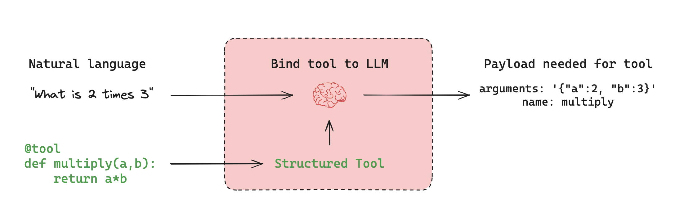

# 工具

许多AI应用通过自然语言与用户交互。然而在某些场景下，模型需要直接与外部系统（如API接口、数据库或文件系统）进行结构化数据交互。[工具调用](../how-tos/tool-calling.md)功能使模型能够生成符合特定输入架构的请求。

**工具**封装了可调用的函数及其输入架构。这些工具可以传递给兼容的[聊天模型](https://python.langchain.com/docs/concepts/chat_models)，让模型自主决定是否调用工具以及如何传递参数。

## 工具调用机制



工具调用通常是**条件触发**的。基于用户输入和可用工具，模型可能选择发起工具调用请求。该请求会以`AIMessage`对象形式返回，其中包含指定工具名称和输入参数的`tool_calls`字段：

```python
llm_with_tools.invoke("2乘以3等于多少？")
# -> AIMessage(tool_calls=[{'name': 'multiply', 'args': {'a': 2, 'b': 3}, ...}])
```

若输入与任何工具无关，模型仅返回自然语言响应：

```python
llm_with_tools.invoke("你好世界！")  # -> AIMessage(content="你好！")
```

需特别注意：模型仅生成调用请求，**不执行**具体工具操作。实际调用由独立执行器（如运行时环境或代理）处理并返回结果。

详见[工具调用指南](../how-tos/tool-calling.md)。

## 预置工具集

LangChain为常见外部系统提供了开箱即用的集成工具，涵盖API接口、数据库、文件系统和网络数据等场景。

浏览[集成工具目录](https://python.langchain.com/docs/integrations/tools/)获取完整清单。

主要分类包括：

* **搜索类**：Bing、SerpAPI、Tavily
* **代码执行类**：Python REPL、Node.js REPL
* **数据库类**：SQL、MongoDB、Redis
* **网络数据类**：网页抓取与浏览
* **API类**：OpenWeatherMap、NewsAPI等

## 自定义工具

您可以使用`@tool`装饰器或普通Python函数创建自定义工具，例如：

```python
from langchain_core.tools import tool

@tool
def multiply(a: int, b: int) -> int:
    """实现两数相乘"""
    return a * b
```

详见[工具调用指南](../how-tos/tool-calling.md)。

## 工具执行流程

虽然模型决定何时调用工具，但具体执行需要运行时组件处理。

LangGraph提供以下预制组件：

* [`ToolNode`][langgraph.prebuilt.tool_node.ToolNode]：执行工具调用的预制节点
* [`create_react_agent`][langgraph.prebuilt.chat_agent_executor.create_react_agent]：构建全自动管理工具调用的代理程序