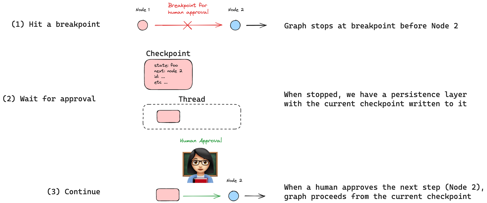
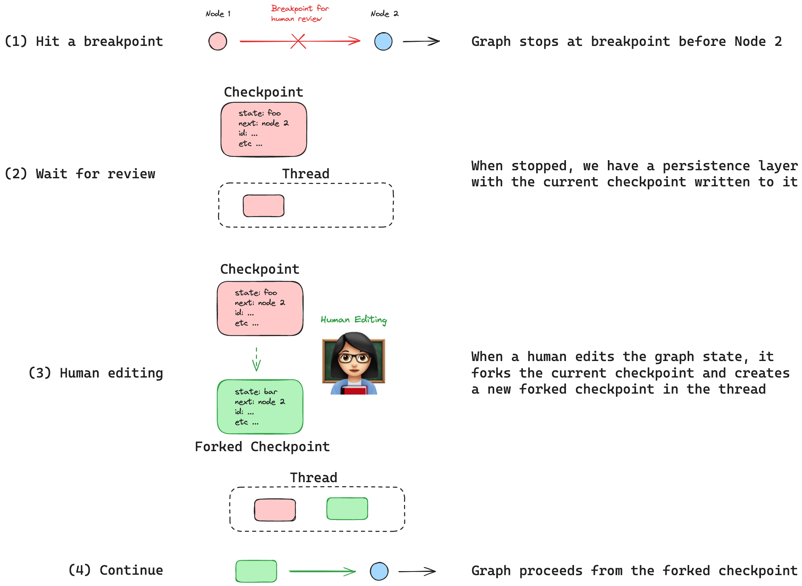
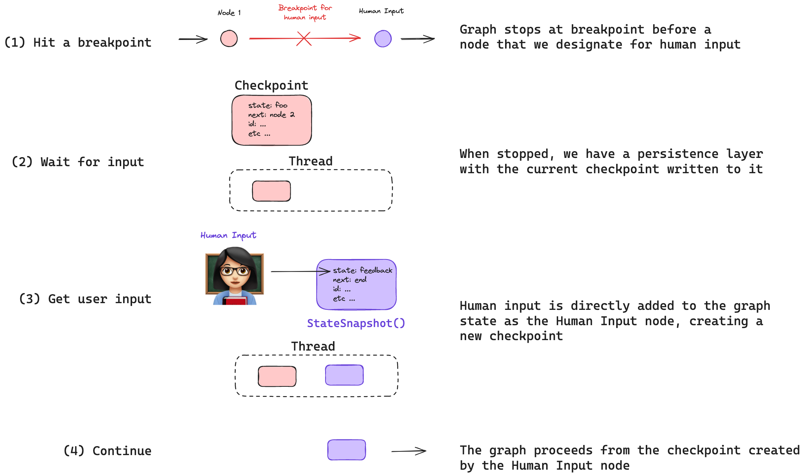
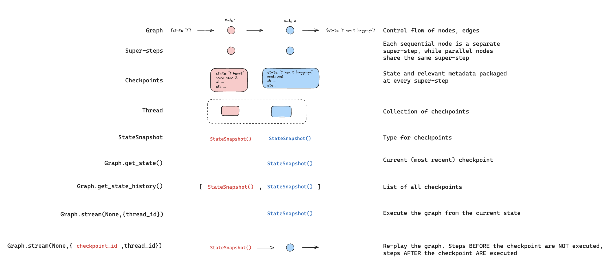

# 人在回路

!!! note "使用 `interrupt` 函数代替。"

    自 LangGraph 0.2.57 版本起，推荐使用 [`interrupt` 函数][langgraph.types.interrupt] 来设置断点，因为它简化了**人在回路**模式。

    请参阅使用 `interrupt` 函数的最新版本[人在回路指南](./human_in_the_loop.md)。

人在回路（或“在环中”）通过几种常见的用户交互模式增强了代理的能力。

常见的交互模式包括：

(1) `批准` - 我们可以中断代理，将当前状态呈现给用户，并允许用户接受某个操作。

(2) `编辑` - 我们可以中断代理，将当前状态呈现给用户，并允许用户编辑代理状态。

(3) `输入` - 我们可以显式创建一个图节点来收集人工输入，并将该输入直接传递给代理状态。

这些交互模式的应用场景包括：

(1) `审查工具调用` - 我们可以中断代理以审查和编辑工具调用的结果。

(2) `时间旅行` - 我们可以手动重放和/或分叉代理的过去操作。

## 持久化

所有这些交互模式都由 LangGraph 内置的[持久化](./persistence.md)层实现，该层将在每一步写入图状态的检查点。持久化允许图停止，以便人工可以审查和/或编辑图的当前状态，然后在人工输入后恢复。

### 断点

在图流程的特定位置添加[断点](./breakpoints.md)是启用人在回路的一种方式。在这种情况下，开发人员知道工作流中*何时*需要人工输入，只需在该特定图节点之前或之后放置一个断点。

在这里，我们使用检查点和断点编译我们的图，断点设置在我们想要中断的节点 `step_for_human_in_the_loop` 之前。然后我们执行上述交互模式之一，如果人工编辑了图状态，将创建一个新的检查点。新的检查点保存到 `thread` 中，我们可以通过传入 `None` 作为输入从那里恢复图的执行。

```python
# 使用检查点和断点编译我们的图，断点设置在 "step_for_human_in_the_loop" 之前
graph = builder.compile(checkpointer=checkpointer, interrupt_before=["step_for_human_in_the_loop"])

# 运行图到断点
thread_config = {"configurable": {"thread_id": "1"}}
for event in graph.stream(inputs, thread_config, stream_mode="values"):
    print(event)
    
# 执行需要人在回路的操作

# 从当前检查点继续图的执行 
for event in graph.stream(None, thread_config, stream_mode="values"):
    print(event)
```

### 动态断点

或者，开发人员可以定义一些*条件*，只有在满足这些条件时才会触发断点。这种[动态断点](./breakpoints.md)的概念在开发人员希望在*特定条件*下停止图时非常有用。这使用了 `NodeInterrupt`，这是一种特殊类型的异常，可以在节点内部根据某些条件引发。例如，我们可以定义一个动态断点，当 `input` 长度超过 5 个字符时触发。

```python
def my_node(state: State) -> State:
    if len(state['input']) > 5:
        raise NodeInterrupt(f"Received input that is longer than 5 characters: {state['input']}")
    return state
```

假设我们运行图时输入触发了动态断点，然后尝试通过传入 `None` 作为输入来恢复图执行。

```python
# 尝试在我们遇到动态断点后继续图执行，不更改状态 
for event in graph.stream(None, thread_config, stream_mode="values"):
    print(event)
```

图将*再次中断*，因为这个节点将使用相同的图状态*重新运行*。我们需要更改图状态，使得触发动态断点的条件不再满足。因此，我们可以简单地将图状态编辑为满足动态断点条件的输入（< 5 个字符）并重新运行该节点。

```python 
# 更新状态以通过动态断点
graph.update_state(config=thread_config, values={"input": "foo"})
for event in graph.stream(None, thread_config, stream_mode="values"):
    print(event)
```

或者，如果我们想保留当前输入并跳过执行检查的节点（`my_node`）怎么办？为此，我们可以简单地执行图更新，使用 `as_node="my_node"` 并传入 `None` 作为值。这将不会更新图状态，但会以 `my_node` 的身份运行更新，从而跳过该节点并绕过动态断点。

```python
# 此更新将完全跳过节点 `my_node`
graph.update_state(config=thread_config, values=None, as_node="my_node")
for event in graph.stream(None, thread_config, stream_mode="values"):
    print(event)
```

请参阅[我们的指南](../how-tos/human_in_the_loop/dynamic_breakpoints.ipynb)以了解如何详细实现这一点！

## 交互模式

### 批准



有时我们希望在代理执行过程中批准某些步骤。

我们可以在[断点](./breakpoints.md)处中断代理，该断点位于我们想要批准的步骤之前。

这通常建议用于敏感操作（例如，使用外部 API 或写入数据库）。

通过持久化，我们可以将当前代理状态以及下一步呈现给用户进行审查和批准。

如果获得批准，图将从最后保存的检查点恢复执行，该检查点保存到 `thread` 中：

```python
# 使用检查点和断点编译我们的图，断点设置在我们想要批准的步骤之前
graph = builder.compile(checkpointer=checkpointer, interrupt_before=["node_2"])

# 运行图到断点
for event in graph.stream(inputs, thread, stream_mode="values"):
    print(event)
    
# ... 获取人工批准 ...

# 如果批准，从最后保存的检查点继续图的执行
for event in graph.stream(None, thread, stream_mode="values"):
    print(event)
```

请参阅[我们的指南](../how-tos/human_in_the_loop/breakpoints.ipynb)以了解如何详细实现这一点！

### 编辑



有时我们希望审查和编辑代理的状态。

与批准类似，我们可以在[断点](./breakpoints.md)处中断代理，该断点位于我们想要检查的步骤之前。

我们可以将当前状态呈现给用户，并允许用户编辑代理状态。

这可以用于纠正代理的错误（例如，参见下面的工具调用部分）。

我们可以通过分叉当前检查点来编辑图状态，该检查点保存到 `thread` 中。

然后我们可以像之前一样从分叉的检查点继续图。

```python
# 使用检查点和断点编译我们的图，断点设置在我们想要审查的步骤之前
graph = builder.compile(checkpointer=checkpointer, interrupt_before=["node_2"])

# 运行图到断点
for event in graph.stream(inputs, thread, stream_mode="values"):
    print(event)
    
# 审查状态，决定编辑它，并使用新状态创建分叉检查点
graph.update_state(thread, {"state": "new state"})

# 从分叉检查点继续图的执行
for event in graph.stream(None, thread, stream_mode="values"):
    print(event)
```

请参阅[此指南](../how-tos/human_in_the_loop/edit-graph-state.ipynb)以了解如何详细实现这一点！

### 输入



有时我们希望在图中的特定步骤显式获取人工输入。

我们可以为此创建一个图节点（例如，在我们的示例图中的 `human_input`）。

与批准和编辑类似，我们可以在[断点](./breakpoints.md)处中断代理，该断点位于此节点之前。

然后我们可以执行包含人工输入的状态更新，就像我们编辑状态时所做的那样。

但是，我们添加了一件事：

我们可以使用 `as_node=human_input` 与状态更新一起指定状态更新*应被视为一个节点*。

这很微妙，但很重要：

在编辑中，用户决定是否编辑图状态。

在输入中，我们显式定义了一个图节点来收集人工输入！

然后，包含人工输入的状态更新将*作为此节点*运行。

```python
# 使用检查点和断点编译我们的图，断点设置在我们想要收集人工输入的步骤之前
graph = builder.compile(checkpointer=checkpointer, interrupt_before=["human_input"])

# 运行图到断点
for event in graph.stream(inputs, thread, stream_mode="values"):
    print(event)
    
# 使用用户输入更新状态，就像它是 human_input 节点一样
graph.update_state(thread, {"user_input": user_input}, as_node="human_input")

# 从 human_input 节点创建的检查点继续图的执行
for event in graph.stream(None, thread, stream_mode="values"):
    print(event)
```

请参阅[此指南](../how-tos/human_in_the_loop/wait-user-input.ipynb)以了解如何详细实现这一点！

## 应用场景

### 审查工具调用

一些用户交互模式结合了上述想法。

例如，许多代理使用[工具调用](https://python.langchain.com/docs/how_to/tool_calling/)来做出决策。

工具调用提出了一个挑战，因为代理必须正确完成两件事：

(1) 要调用的工具的名称

(2) 传递给工具的参数

即使工具调用是正确的，我们也可能希望应用谨慎：

(3) 工具调用可能是我们想要批准的敏感操作

考虑到这些点，我们可以结合上述想法来创建工具调用的人在回路审查。

```python
# 使用检查点和断点编译我们的图，断点设置在我们想要审查来自 LLM 的工具调用的步骤之前
graph = builder.compile(checkpointer=checkpointer, interrupt_before=["human_review"])

# 运行图到断点
for event in graph.stream(inputs, thread, stream_mode="values"):
    print(event)
    
# 审查工具调用并根据需要更新它，作为 human_review 节点
graph.update_state(thread, {"tool_call": "updated tool call"}, as_node="human_review")

# 否则，批准工具调用并继续图的执行，不做编辑

# 从以下任一检查点继续图的执行：
# (1) 由 human_review 创建的分叉检查点 或
# (2) 工具调用最初创建时保存的检查点（在 human_review 中没有编辑）
for event in graph.stream(None, thread, stream_mode="values"):
    print(event)
```

请参阅[此指南](../how-tos/human_in_the_loop/review-tool-calls.ipynb)以了解如何详细实现这一点！

### 时间旅行

在处理代理时，我们经常希望仔细检查其决策过程：

(1) 即使他们达到了期望的最终结果，导致该结果的推理过程通常也很重要。

(2) 当代理犯错时，了解原因通常很有价值。

(3) 在上述任何情况下，手动探索替代决策路径都很有用。

总的来说，我们将这些调试概念称为`时间旅行`，它们由`重放`和`分叉`组成。

#### 重放



有时我们只是想重放代理的过去操作。

上面，我们展示了从图的当前状态（或检查点）执行代理的案例。

我们只需在 `thread` 中传入 `None` 作为输入。

```
thread = {"configurable": {"thread_id": "1"}}
for event in graph.stream(None, thread, stream_mode="values"):
    print(event)
```

现在，我们可以通过传入检查点 ID 来修改此操作，以从*特定*检查点重放过去的操作。

要获取特定的检查点 ID，我们可以轻松获取线程中的所有检查点并过滤到我们想要的检查点。

```python
all_checkpoints = []
for state in app.get_state_history(thread):
    all_checkpoints.append(state)
```

每个检查点都有一个唯一的 ID，我们可以使用它来从特定检查点重放。

假设通过审查检查点，我们想要从其中一个 `xxx` 重放。

我们只需在运行图时传入检查点 ID。

```python
config = {'configurable': {'thread_id': '1', 'checkpoint_id': 'xxx'}}
for event in graph.stream(None, config, stream_mode="values"):
    print(event)
```
 
重要的是，图知道哪些检查点已经执行过。

因此，它将重新播放任何先前执行的节点，而不是重新执行它们。

请参阅[此附加概念指南](https://langchain-ai.github.io/langgraph/concepts/persistence/#replay)以了解相关上下文。

请参阅[此指南](../how-tos/human_in_the_loop/time-travel.ipynb)以了解如何详细实现时间旅行！

#### 分叉


有时我们希望分叉代理的过去操作，并探索图中的不同路径。

如上所述，`编辑`正是我们对图的*当前*状态执行此操作的方式！

但是，如果我们想要分叉图的*过去*状态怎么办？

例如，假设我们想要编辑特定检查点 `xxx`。

我们在更新图状态时传入此 `checkpoint_id`。

```python
config = {"configurable": {"thread_id": "1", "checkpoint_id": "xxx"}}
graph.update_state(config, {"state": "updated state"}, )
```

这将创建一个新的分叉检查点 `xxx-fork`，然后我们可以从该检查点运行图。

```python
config = {'configurable': {'thread_id': '1', 'checkpoint_id': 'xxx-fork'}}
for event in graph.stream(None, config, stream_mode="values"):
    print(event)
```

请参阅[此附加概念指南](https://langchain-ai.github.io/langgraph/concepts/persistence/#update-state)以了解相关上下文。

请参阅[此指南](../how-tos/human_in_the_loop/time-travel.ipynb)以了解如何详细实现时间旅行！