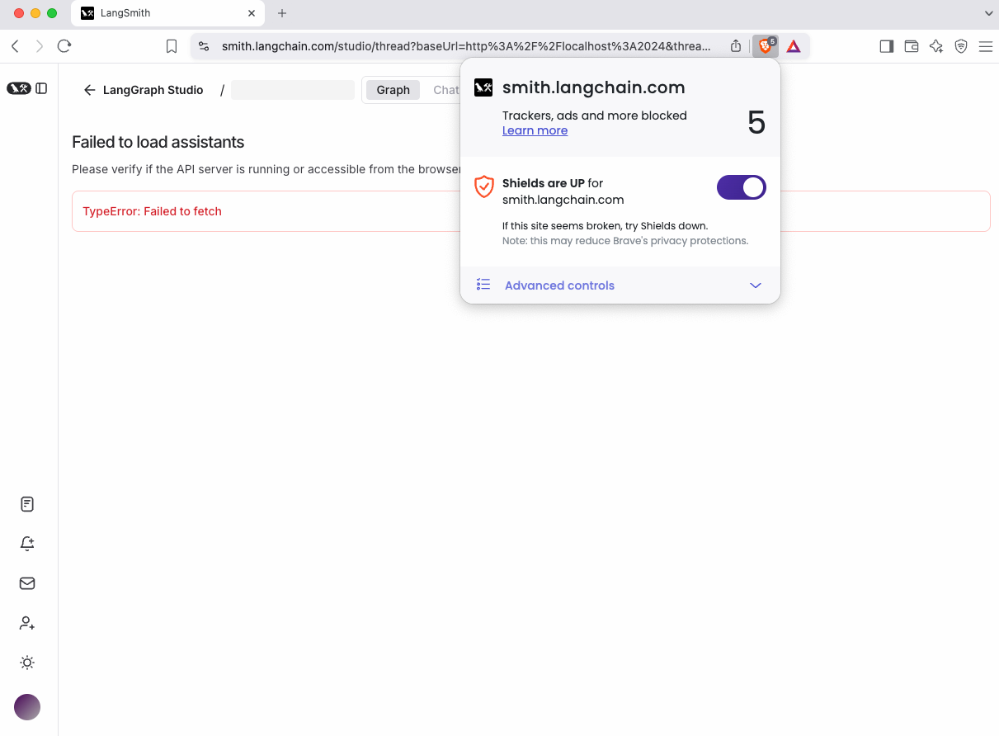

# LangGraph Studio 故障排除指南

## :fontawesome-brands-safari:{ .safari } Safari连接问题

Safari浏览器会阻止localhost的纯HTTP流量。当运行`langgraph dev`启动Studio时，您可能会看到"无法加载助手"的错误提示。

### 解决方案1：使用Cloudflare隧道

=== "Python"

    ```shell
    pip install -U langgraph-cli>=0.2.6
    langgraph dev --tunnel
    ```

=== "JS"

    ```shell
    # Requires @langchain/langgraph-cli>=0.0.26
    npx @langchain/langgraph-cli dev
    ```

命令将输出以下格式的URL：

```shell
https://smith.langchain.com/studio/?baseUrl=https://hamilton-praise-heart-costumes.trycloudflare.com
```

在Safari中使用这个URL访问Studio。其中`baseUrl`参数指定了您的代理服务器端点。

### 解决方案2：使用Chromium内核浏览器

Chrome和其他Chromium内核浏览器允许localhost的HTTP流量。直接使用`langgraph dev`命令无需额外配置。

## :fontawesome-brands-brave:{ .brave } Brave浏览器连接问题

当Brave Shields防护功能启用时，Brave会阻止localhost的纯HTTP流量。运行`langgraph dev`时可能出现"无法加载助手"错误。

### 解决方案1：禁用Brave Shields

通过URL栏的Brave图标，临时为LangSmith禁用Brave Shields功能。



### 解决方案2：使用Cloudflare隧道

=== "Python"

    ```shell
    pip install -U langgraph-cli>=0.2.6
    langgraph dev --tunnel
    ```

=== "JS"

    ```shell
    # Requires @langchain/langgraph-cli>=0.0.26
    npx @langchain/langgraph-cli dev
    ```

命令生成的URL格式如下：

```shell
https://smith.langchain.com/studio/?baseUrl=https://hamilton-praise-heart-costumes.trycloudflare.com
```

在Brave中使用该URL访问Studio。`baseUrl`参数标识了您的代理服务器端点。

## 图形连线问题

未明确定义的条件分支可能会在图形中显示意外的连接关系，这是因为LangGraph Studio在没有正确定义时会默认条件分支可能访问所有其他节点。可通过以下方法明确指定路由路径：

### 解决方案1：路径映射

定义路由器输出与目标节点的映射关系：

=== "Python"

    ```python
    graph.add_conditional_edges("node_a", routing_function, {True: "node_b", False: "node_c"})
    ```

=== "Javascript"

    ```ts
    graph.addConditionalEdges("node_a", routingFunction, { true: "node_b", false: "node_c" });
    ```

### 解决方案2：路由器类型定义(Python)

使用Python的`Literal`类型指定可能的路由目标：

```python
def routing_function(state: GraphState) -> Literal["node_b","node_c"]:
    if state['some_condition'] == True:
        return "node_b"
    else:
        return "node_c"
```