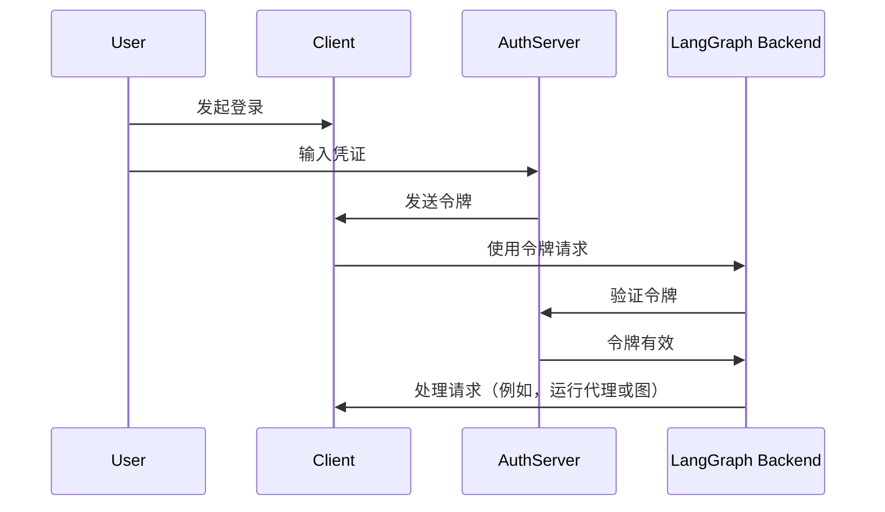

# 连接认证提供者（第三部分/共三部分）

!!! note "这是认证系列的第三部分："

    1. [基础认证](getting_started.md) - 控制谁可以访问你的机器人
    2. [资源授权](resource_auth.md) - 让用户拥有私人对话
    3. 生产环境认证（你在这里） - 添加真实用户账户并使用 OAuth2 进行验证

在[让对话私密化](resource_auth.md)教程中，我们添加了[资源授权](../../concepts/auth.md#resource-authorization)以赋予用户私人对话。然而，我们仍然使用硬编码的令牌进行认证，这是不安全的。现在我们将使用[OAuth2](../../concepts/auth.md#oauth2-authentication)替换这些令牌，使用真实用户账户。

我们将保留相同的[`Auth`](../../cloud/reference/sdk/python_sdk_ref.md#langgraph_sdk.auth.Auth)对象和[资源级访问控制](../../concepts/auth.md#resource-level-access-control)，但升级我们的认证以使用 Supabase 作为我们的身份提供者。虽然在本教程中使用 Supabase，但这些概念适用于任何 OAuth2 提供者。你将学习如何：

1. 用真实的[JWT 令牌](../../concepts/auth.md#jwt-tokens)替换测试令牌
2. 与 OAuth2 提供者集成以实现安全的用户认证
3. 处理用户会话和元数据，同时保持我们现有的授权逻辑

## 要求

你需要设置一个 Supabase 项目以使用其认证服务器进行本教程。你可以在这里进行设置[这里](https://supabase.com/dashboard)。

## 背景

OAuth2 涉及三个主要角色：

1. **认证服务器**：身份提供者（例如 Supabase、Auth0、Google），处理用户认证并颁发令牌
2. **应用后端**：你的 LangGraph 应用。它验证令牌并提供受保护的资源（对话数据）
3. **客户端应用**：用户与之交互的 Web 或移动应用

标准的 OAuth2 流程如下：



在以下示例中，我们将使用 Supabase 作为我们的认证服务器。LangGraph 应用将提供你的应用的后端，我们将为客户端应用编写测试代码。
让我们开始吧！

## 设置认证提供者 {#setup-auth-provider}

首先，让我们安装所需的依赖项。在你的 `custom-auth` 目录中开始，并确保你已经安装了 `langgraph-cli`：

```bash
cd custom-auth
pip install -U "langgraph-cli[inmem]"
```

接下来，我们需要获取我们的认证服务器的 URL 和用于认证的私钥。
由于我们使用 Supabase，我们可以在 Supabase 仪表板中完成此操作：

1. 在左侧边栏中，点击⚙️“项目设置”，然后点击“API”
2. 复制你的项目 URL 并将其添加到你的 `.env` 文件中

```shell
echo "SUPABASE_URL=your-project-url" >> .env
```
3. 接下来，复制你的服务角色密钥并将其添加到你的 `.env` 文件中
```shell
echo "SUPABASE_SERVICE_KEY=your-service-role-key" >> .env
```
4. 最后，复制你的“匿名公共”密钥并记下它。稍后我们设置客户端代码时将使用它。

```bash
SUPABASE_URL=your-project-url
SUPABASE_SERVICE_KEY=your-service-role-key
```

## 实现令牌验证

在之前的教程中，我们使用[`Auth`](../../cloud/reference/sdk/python_sdk_ref.md#langgraph_sdk.auth.Auth)对象来：

1. 在[认证教程](getting_started.md)中验证硬编码的令牌
2. 在[授权教程](resource_auth.md)中添加资源所有权

现在我们将升级我们的认证以验证来自 Supabase 的真实 JWT 令牌。关键的变化将在[`@auth.authenticate`](../../cloud/reference/sdk/python_sdk_ref.md#langgraph_sdk.auth.Auth.authenticate)装饰的函数中：

1. 我们将不再检查硬编码的令牌列表，而是向 Supabase 发起 HTTP 请求以验证令牌
2. 我们将从验证的令牌中提取真实的用户信息（ID、电子邮件）

我们将保持现有的资源授权逻辑不变

让我们更新 `src/security/auth.py` 以实现这一点：

```python hl_lines="8-9 20-30" title="src/security/auth.py"
import os
import httpx
from langgraph_sdk import Auth

auth = Auth()

# 这是从你上面创建的 `.env` 文件中加载的
SUPABASE_URL = os.environ["SUPABASE_URL"]
SUPABASE_SERVICE_KEY = os.environ["SUPABASE_SERVICE_KEY"]


@auth.authenticate
async def get_current_user(authorization: str | None):
    """验证 JWT 令牌并提取用户信息。"""
    assert authorization
    scheme, token = authorization.split()
    assert scheme.lower() == "bearer"

    try:
        # 向认证提供者验证令牌
        async with httpx.AsyncClient() as client:
            response = await client.get(
                f"{SUPABASE_URL}/auth/v1/user",
                headers={
                    "Authorization": authorization,
                    "apiKey": SUPABASE_SERVICE_KEY,
                },
            )
            assert response.status_code == 200
            user = response.json()
            return {
                "identity": user["id"],  # 唯一用户标识符
                "email": user["email"],
                "is_authenticated": True,
            }
    except Exception as e:
        raise Auth.exceptions.HTTPException(status_code=401, detail=str(e))

# ... 其余部分与之前相同

# 保留我们之前教程中的资源授权
@auth.on
async def add_owner(ctx, value):
    """使用资源元数据使资源对其创建者私有。"""
    filters = {"owner": ctx.user.identity}
    metadata = value.setdefault("metadata", {})
    metadata.update(filters)
    return filters
```

最重要的变化是，我们现在使用真实的认证服务器验证令牌。我们的认证处理程序拥有 Supabase 项目的私钥，我们可以使用它来验证用户的令牌并提取他们的信息。

让我们用真实用户账户测试一下！

## 测试认证流程

让我们测试我们的新认证流程。你可以在文件或笔记本中运行以下代码。你需要提供：

- 一个有效的电子邮件地址
- 一个 Supabase 项目 URL（来自[上面](#setup-auth-provider)）
- 一个 Supabase 匿名**公共密钥**（也来自[上面](#setup-auth-provider)）

```python
import os
import httpx
from getpass import getpass
from langgraph_sdk import get_client


# 从命令行获取电子邮件
email = getpass("输入你的电子邮件：")
base_email = email.split("@")
password = "secure-password"  # 请更改
email1 = f"{base_email[0]}+1@{base_email[1]}"
email2 = f"{base_email[0]}+2@{base_email[1]}"

SUPABASE_URL = os.environ.get("SUPABASE_URL")
if not SUPABASE_URL:
    SUPABASE_URL = getpass("输入你的 Supabase 项目 URL：")

# 这是你的公共匿名密钥（可以安全地在客户端使用）
# 不要将其与服务角色密钥混淆
SUPABASE_ANON_KEY = os.environ.get("SUPABASE_ANON_KEY")
if not SUPABASE_ANON_KEY:
    SUPABASE_ANON_KEY = getpass("输入你的 Supabase 公共匿名密钥：")


async def sign_up(email: str, password: str):
    """创建一个新用户账户。"""
    async with httpx.AsyncClient() as client:
        response = await client.post(
            f"{SUPABASE_URL}/auth/v1/signup",
            json={"email": email, "password": password},
            headers={"apiKey": SUPABASE_ANON_KEY},
        )
        assert response.status_code == 200
        return response.json()

# 创建两个测试用户
print(f"创建测试用户：{email1} 和 {email2}")
await sign_up(email1, password)
await sign_up(email2, password)
```

然后运行代码。

!!! tip "关于测试电子邮件"
    我们将通过在你的电子邮件中添加“+1”和“+2”来创建两个测试账户。例如，如果你使用“myemail@gmail.com”，我们将创建“myemail+1@gmail.com”和“myemail+2@gmail.com”。所有电子邮件都将发送到你的原始地址。

⚠️ 继续之前：检查你的电子邮件并点击两个确认链接。Supabase 将在你确认用户电子邮件之前拒绝 `/login` 请求。

现在让我们测试用户只能看到自己的数据。确保服务器正在运行（运行 `langgraph dev`）后再继续。以下代码片段需要你在[设置认证提供者](#setup-auth-provider)时从 Supabase 仪表板复制的“匿名公共”密钥。

```python
async def login(email: str, password: str):
    """获取现有用户的访问令牌。"""
    async with httpx.AsyncClient() as client:
        response = await client.post(
            f"{SUPABASE_URL}/auth/v1/token?grant_type=password",
            json={
                "email": email,
                "password": password
            },
            headers={
                "apikey": SUPABASE_ANON_KEY,
                "Content-Type": "application/json"
            },
        )
        assert response.status_code == 200
        return response.json()["access_token"]


# 以用户 1 身份登录
user1_token = await login(email1, password)
user1_client = get_client(
    url="http://localhost:2024", headers={"Authorization": f"Bearer {user1_token}"}
)

# 以用户 1 身份创建一个线程
thread = await user1_client.threads.create()
print(f"✅ 用户 1 创建了线程：{thread['thread_id']}")

# 尝试在没有令牌的情况下访问
unauthenticated_client = get_client(url="http://localhost:2024")
try:
    await unauthenticated_client.threads.create()
    print("❌ 未认证的访问应该失败！")
except Exception as e:
    print("✅ 未认证的访问被阻止：", e)

# 尝试以用户 2 身份访问用户 1 的线程
user2_token = await login(email2, password)
user2_client = get_client(
    url="http://localhost:2024", headers={"Authorization": f"Bearer {user2_token}"}
)

try:
    await user2_client.threads.get(thread["thread_id"])
    print("❌ 用户 2 不应该看到用户 1 的线程！")
except Exception as e:
    print("✅ 用户 2 被阻止访问用户 1 的线程：", e)
```
输出应该如下所示：

```shell
✅ 用户 1 创建了线程：d6af3754-95df-4176-aa10-dbd8dca40f1a
✅ 未认证的访问被阻止：客户端错误 '403 Forbidden'，URL 'http://localhost:2024/threads'
✅ 用户 2 被阻止访问用户 1 的线程：客户端错误 '404 Not Found'，URL 'http://localhost:2024/threads/d6af3754-95df-4176-aa10-dbd8dca40f1a'
```

完美！我们的认证和授权正在协同工作：
1. 用户必须登录才能访问机器人
2. 每个用户只能看到自己的线程

我们的所有用户都由 Supabase 认证提供者管理，因此我们不需要实现任何额外的用户管理逻辑。

## 恭喜！🎉

你已经成功为你的 LangGraph 应用构建了一个生产就绪的认证系统！让我们回顾一下你完成的工作：

1. 设置了一个认证提供者（本例中使用 Supabase）
2. 添加了带有电子邮件/密码认证的真实用户账户
3. 将 JWT 令牌验证集成到你的 LangGraph 服务器中
4. 实现了适当的授权以确保用户只能访问自己的数据
5. 创建了一个基础，准备处理你的下一个认证挑战 🚀

这完成了我们的认证教程系列。你现在拥有了一个安全、生产就绪的 LangGraph 应用的基础。

## 接下来是什么？

现在你已经有了生产环境认证，考虑：

1. 使用你喜欢的框架构建一个 Web UI（参见[自定义认证](https://github.com/langchain-ai/custom-auth)模板以获取示例）
2. 在[认证概念指南](../../concepts/auth.md)中了解更多关于认证和授权的其他方面。
3. 在阅读[参考文档](../../cloud/reference/sdk/python_sdk_ref.md#langgraph_sdk.auth.Auth)后进一步自定义你的处理程序和设置。