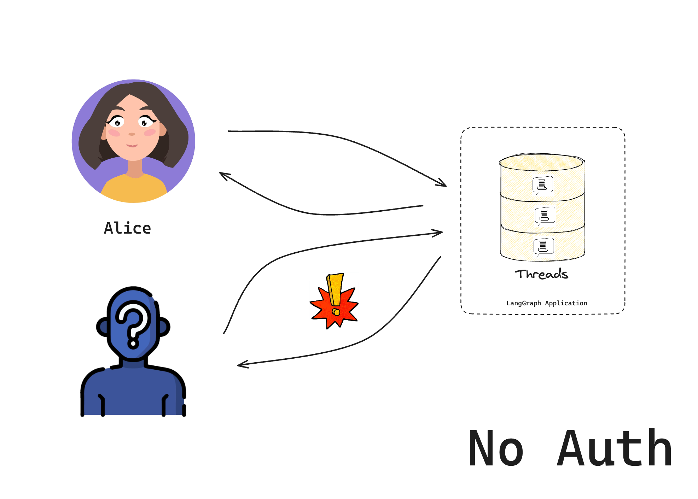
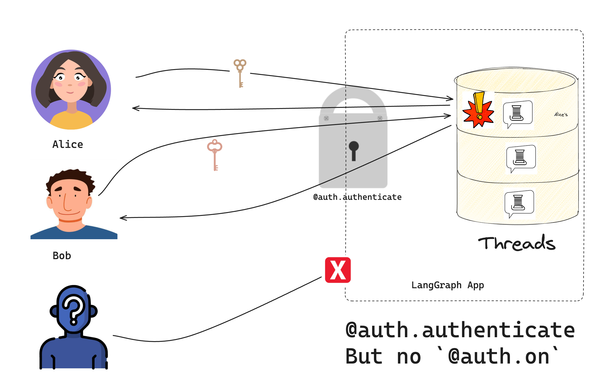

# 设置自定义认证（第1部分/共3部分）

!!! note "这是我们的认证系列的第1部分："

    1. 基础认证（你在这里）- 控制谁可以访问你的机器人
    2. [资源授权](resource_auth.md) - 让用户拥有私人对话
    3. [生产环境认证](add_auth_server.md) - 添加真实用户账户并使用OAuth2进行验证

!!! tip "前提条件"

    本指南假设你对以下概念有基本了解：

      *  [**认证与访问控制**](../../concepts/auth.md)
      *  [**LangGraph平台**](../../concepts/index.md#langgraph-platform)

!!! note "仅限Python"

    我们目前仅在Python部署中支持自定义认证和授权，要求`langgraph-api>=0.0.11`。对LangGraph.JS的支持将很快添加。

???+ note "按部署类型支持"

    自定义认证在**托管LangGraph云**中的所有部署以及**企业**自托管计划中都受支持。**Lite**自托管计划不支持。

在本教程中，我们将构建一个只允许特定用户访问的聊天机器人。我们将从LangGraph模板开始，逐步添加基于令牌的安全性。到最后，你将拥有一个在允许访问之前检查有效令牌的工作聊天机器人。

## 设置我们的项目

首先，让我们使用LangGraph启动模板创建一个新的聊天机器人：

```bash
pip install -U "langgraph-cli[inmem]"
langgraph new --template=new-langgraph-project-python custom-auth
cd custom-auth
```

该模板为我们提供了一个占位符的LangGraph应用程序。让我们通过安装本地依赖项并运行开发服务器来尝试它。
```shell
pip install -e .
langgraph dev
```
如果一切正常，服务器应该启动并在浏览器中打开Studio。

> - 🚀 API: http://127.0.0.1:2024
> - 🎨 Studio UI: https://smith.langchain.com/studio/?baseUrl=http://127.0.0.1:2024
> - 📚 API Docs: http://127.0.0.1:2024/docs
> 
> 此内存服务器设计用于开发和测试。
> 生产环境请使用LangGraph云。

图表应该运行，如果你将其自托管在公共互联网上，任何人都可以访问它！



现在我们已经看到了基础的LangGraph应用程序，让我们为它添加认证！

???+ tip "占位符令牌"
    
    在第1部分中，我们将从一个硬编码的令牌开始，用于说明目的。
    在掌握了基础知识之后，我们将在第3部分中实现“生产就绪”的认证方案。

## 添加认证

[`Auth`](../../cloud/reference/sdk/python_sdk_ref.md#langgraph_sdk.auth.Auth)对象允许你注册一个认证函数，LangGraph平台将在每个请求上运行该函数。此函数接收每个请求并决定是否接受或拒绝。

创建一个新文件`src/security/auth.py`。这是我们用来检查用户是否被允许访问机器人的代码：

```python hl_lines="10 15-16" title="src/security/auth.py"
from langgraph_sdk import Auth

# 这是我们的玩具用户数据库。生产环境中不要这样做
VALID_TOKENS = {
    "user1-token": {"id": "user1", "name": "Alice"},
    "user2-token": {"id": "user2", "name": "Bob"},
}

# "Auth"对象是一个容器，LangGraph将使用它来标记我们的认证函数
auth = Auth()


# `authenticate`装饰器告诉LangGraph将此函数作为中间件调用
# 用于每个请求。这将决定是否允许请求
@auth.authenticate
async def get_current_user(authorization: str | None) -> Auth.types.MinimalUserDict:
    """检查用户的令牌是否有效。"""
    assert authorization
    scheme, token = authorization.split()
    assert scheme.lower() == "bearer"
    # 检查令牌是否有效
    if token not in VALID_TOKENS:
        raise Auth.exceptions.HTTPException(status_code=401, detail="无效令牌")

    # 如果有效，返回用户信息
    user_data = VALID_TOKENS[token]
    return {
        "identity": user_data["id"],
    }
```

注意，我们的[认证](../../cloud/reference/sdk/python_sdk_ref.md#langgraph_sdk.auth.Auth.authenticate)处理程序做了两件重要的事情：

1. 检查请求的[Authorization头](https://developer.mozilla.org/en-US/docs/Web/HTTP/Headers/Authorization)中是否提供了有效令牌
2. 返回用户的[身份](../../cloud/reference/sdk/python_sdk_ref.md#langgraph_sdk.auth.types.MinimalUserDict)

现在，通过将以下内容添加到[`langgraph.json`](../../cloud/reference/cli.md#configuration-file)配置中，告诉LangGraph使用我们的认证：

```json hl_lines="7-9" title="langgraph.json"
{
  "dependencies": ["."],
  "graphs": {
    "agent": "./src/agent/graph.py:graph"
  },
  "env": ".env",
  "auth": {
    "path": "src/security/auth.py:auth"
  }
}
```

## 测试我们的“安全”机器人

让我们再次启动服务器来测试一切！

```bash
langgraph dev --no-browser
```

??? note "Studio中的自定义认证"

    如果你没有添加`--no-browser`，Studio UI将在浏览器中打开。你可能会想，Studio如何仍然能够连接到我们的服务器？默认情况下，即使使用自定义认证，我们也允许从LangGraph Studio访问。这使得在Studio中开发和测试你的机器人更加容易。你可以通过在你的认证配置中设置`disable_studio_auth: "true"`来删除此替代认证选项：
    ```json
    {
        "auth": {
            "path": "src/security/auth.py:auth",
            "disable_studio_auth": "true"
        }
    }
    ```

现在让我们尝试与我们的机器人聊天。如果我们正确实现了认证，我们应该只有在请求头中提供有效令牌时才能访问机器人。然而，在我们添加[资源授权处理程序](../../concepts/auth.md#resource-authorization)之前，用户仍然可以访问彼此的资源。



在文件或笔记本中运行以下代码：

```python
from langgraph_sdk import get_client

# 尝试不使用令牌（应该失败）
client = get_client(url="http://localhost:2024")
try:
    thread = await client.threads.create()
    print("❌ 没有令牌时应该失败！")
except Exception as e:
    print("✅ 正确阻止访问:", e)

# 尝试使用有效令牌
client = get_client(
    url="http://localhost:2024", headers={"Authorization": "Bearer user1-token"}
)

# 创建线程并聊天
thread = await client.threads.create()
print(f"✅ 以Alice身份创建线程: {thread['thread_id']}")

response = await client.runs.create(
    thread_id=thread["thread_id"],
    assistant_id="agent",
    input={"messages": [{"role": "user", "content": "Hello!"}]},
)
print("✅ 机器人响应:")
print(response)
```

你应该看到：

1. 没有有效令牌时，我们无法访问机器人
2. 使用有效令牌时，我们可以创建线程并聊天

恭喜！你已经构建了一个只允许“认证”用户访问的聊天机器人。虽然这个系统（尚未）实现生产就绪的安全方案，但我们已经学习了如何控制访问我们机器人的基本机制。在下一个教程中，我们将学习如何为每个用户提供他们自己的私人对话。

## 下一步是什么？

现在你可以控制谁可以访问你的机器人，你可能想：

1. 继续教程，前往[使对话私有化（第2部分/共3部分）](resource_auth.md)学习资源授权。
2. 阅读更多关于[认证概念](../../concepts/auth.md)的内容。
3. 查看[API参考](../../cloud/reference/sdk/python_sdk_ref.md)以获取更多认证细节。