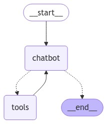

# 添加工具

为了让您的聊天机器人能够处理无法"凭记忆"回答的查询，可以集成一个网络搜索工具。聊天机器人可以使用该工具查找相关信息并提供更好的回答。

!!! note

    本教程基于[构建基础聊天机器人](./1-build-basic-chatbot.md)的内容。

## 先决条件

开始本教程前，请确保满足以下条件：

- 拥有[Tavily搜索引擎](https://python.langchain.com/docs/integrations/tools/tavily_search/)的API密钥。

## 1. 安装搜索引擎

安装[Tavily搜索引擎](https://python.langchain.com/docs/integrations/tools/tavily_search/)所需依赖：

```bash
pip install -U langchain-tavily
```

## 2. 配置环境

使用搜索引擎API密钥配置您的环境：

```bash
_set_env("TAVILY_API_KEY")
```

```
TAVILY_API_KEY:  ········
```

## 3. 定义工具

定义网络搜索工具：

```python
from langchain_tavily import TavilySearch

tool = TavilySearch(max_results=2)
tools = [tool]
tool.invoke("What's a 'node' in LangGraph?")
```

返回结果为页面摘要，我们的聊天机器人可用其回答问题：

```
{'query': "What's a 'node' in LangGraph?",
'follow_up_questions': None,
'answer': None,
'images': [],
'results': [{'title': "Introduction to LangGraph: A Beginner's Guide - Medium",
'url': 'https://medium.com/@cplog/introduction-to-langgraph-a-beginners-guide-14f9be027141',
'content': 'Stateful Graph: LangGraph revolves around the concept of a stateful graph, where each node in the graph represents a step in your computation, and the graph maintains a state that is passed around and updated as the computation progresses. LangGraph supports conditional edges, allowing you to dynamically determine the next node to execute based on the current state of the graph. We define nodes for classifying the input, handling greetings, and handling search queries. def classify_input_node(state): LangGraph is a versatile tool for building complex, stateful applications with LLMs. By understanding its core concepts and working through simple examples, beginners can start to leverage its power for their projects. Remember to pay attention to state management, conditional edges, and ensuring there are no dead-end nodes in your graph.',
'score': 0.7065353,
'raw_content': None},
{'title': 'LangGraph Tutorial: What Is LangGraph and How to Use It?',
'url': 'https://www.datacamp.com/tutorial/langgraph-tutorial',
'content': 'LangGraph is a library within the LangChain ecosystem that provides a framework for defining, coordinating, and executing multiple LLM agents (or chains) in a structured and efficient manner. By managing the flow of data and the sequence of operations, LangGraph allows developers to focus on the high-level logic of their applications rather than the intricacies of agent coordination. Whether you need a chatbot that can handle various types of user requests or a multi-agent system that performs complex tasks, LangGraph provides the tools to build exactly what you need. LangGraph significantly simplifies the development of complex LLM applications by providing a structured framework for managing state and coordinating agent interactions.',
'score': 0.5008063,
'raw_content': None}],
'response_time': 1.38}
```

## 4. 定义图

在[第一个教程](./1-build-basic-chatbot.md)创建的`StateGraph`中，在LLM上添加`bind_tools`。这使LLM知道如果想使用搜索引擎时正确的JSON格式。

首先选择LLM：

{!snippets/chat_model_tabs.md!}

<!---
```python
from langchain.chat_models import init_chat_model

llm = init_chat_model("anthropic:claude-3-5-sonnet-latest")
```
-->

现在将其纳入`StateGraph`：

```python hl_lines="15"
from typing import Annotated

from typing_extensions import TypedDict

from langgraph.graph import StateGraph, START, END
from langgraph.graph.message import add_messages

class State(TypedDict):
    messages: Annotated[list, add_messages]

graph_builder = StateGraph(State)

# 修改：告知LLM可以调用哪些工具
# highlight-next-line
llm_with_tools = llm.bind_tools(tools)

def chatbot(state: State):
    return {"messages": [llm_with_tools.invoke(state["messages"])]}

graph_builder.add_node("chatbot", chatbot)
```

## 5. 创建工具运行函数

现在创建一个函数，在被调用时运行工具。通过添加工具到名为`BasicToolNode`的新节点实现，该节点检查状态中的最新消息，如果消息包含`tool_calls`则调用工具。它依赖于LLM的`tool_calling`支持，该功能在Anthropic、OpenAI、Google Gemini和其他多个LLM提供商中可用。

```python
import json

from langchain_core.messages import ToolMessage


class BasicToolNode:
    """运行最后AIMessage中请求工具的节点"""

    def __init__(self, tools: list) -> None:
        self.tools_by_name = {tool.name: tool for tool in tools}

    def __call__(self, inputs: dict):
        if messages := inputs.get("messages", []):
            message = messages[-1]
        else:
            raise ValueError("No message found in input")
        outputs = []
        for tool_call in message.tool_calls:
            tool_result = self.tools_by_name[tool_call["name"]].invoke(
                tool_call["args"]
            )
            outputs.append(
                ToolMessage(
                    content=json.dumps(tool_result),
                    name=tool_call["name"],
                    tool_call_id=tool_call["id"],
                )
            )
        return {"messages": outputs}


tool_node = BasicToolNode(tools=[tool])
graph_builder.add_node("tools", tool_node)
```

!!! note

    如果将来不想自己构建，可以使用LangGraph预建的[ToolNode](https://langchain-ai.github.io/langgraph/reference/agents/#langgraph.prebuilt.tool_node.ToolNode)。

## 6. 定义`conditional_edges`

添加工具节点后，现在可以定义`conditional_edges`。

**边**从一个节点路由控制流到下一个节点。**条件边**从单个节点开始，通常包含"if"语句，根据当前图状态路由到不同节点。这些函数接收当前图`state`并返回字符串或字符串列表，指示接下来要调用的节点。

接下来，定义一个名为`route_tools`的路由函数，检查聊天机器人输出中的`tool_calls`。通过调用`add_conditional_edges`将此函数提供给图，告诉图每当`chatbot`节点完成时检查此函数以确定下一步去向。

如果存在工具调用，条件将路由到`tools`；如果不存在，则路由到`END`。因为条件可以返回`END`，这次无需显式设置`finish_point`。

```python
def route_tools(
    state: State,
):
    """
    在conditional_edge中使用，如果最后消息有工具调用则路由到ToolNode，
    否则路由到结束。
    """
    if isinstance(state, list):
        ai_message = state[-1]
    elif messages := state.get("messages", []):
        ai_message = messages[-1]
    else:
        raise ValueError(f"No messages found in input state to tool_edge: {state}")
    if hasattr(ai_message, "tool_calls") and len(ai_message.tool_calls) > 0:
        return "tools"
    return END


# `tools_condition`函数如果聊天机器人请求使用工具则返回"tools"，
# 如果直接回答则返回"END"。这一条件路由定义了主要代理循环。
graph_builder.add_conditional_edges(
    "chatbot",
    route_tools,
    # 以下字典使您可以告诉图将条件的输出解释为特定节点
    # 默认是恒等函数，但如果想使用除"tools"外其他名称的节点，
    # 可以更新字典的值，例如"tools": "my_tools"
    {"tools": "tools", END: END},
)
# 任何时候调用工具后，我们返回聊天机器人决定下一步
graph_builder.add_edge("tools", "chatbot")
graph_builder.add_edge(START, "chatbot")
graph = graph_builder.compile()
```

!!! note

    您可以用预建的[tools_condition](https://langchain-ai.github.io/langgraph/reference/prebuilt/#tools_condition)替换此内容，更加简洁。

## 7. 可视化图（可选）

可以使用`get_graph`方法和"draw"方法之一，如`draw_ascii`或`draw_png`，可视化图。`draw`方法各自需要额外依赖。

```python
from IPython.display import Image, display

try:
    display(Image(graph.get_graph().draw_mermaid_png()))
except Exception:
    # 需要额外依赖，是可选的
    pass
```



## 8. 向机器人提问

现在可以向聊天机器人询问其训练数据之外的问题：

```python
def stream_graph_updates(user_input: str):
    for event in graph.stream({"messages": [{"role": "user", "content": user_input}]}):
        for value in event.values():
            print("Assistant:", value["messages"][-1].content)

while True:
    try:
        user_input = input("User: ")
        if user_input.lower() in ["quit", "exit", "q"]:
            print("Goodbye!")
            break

        stream_graph_updates(user_input)
    except:
        # 如果input()不可用时的备用方案
        user_input = "What do you know about LangGraph?"
        print("User: " + user_input)
        stream_graph_updates(user_input)
        break
```

``` 
Assistant: [{'text': "To provide you with accurate and up-to-date information about LangGraph, I'll need to search for the latest details. Let me do that for you.", 'type': 'text'}, {'id': 'toolu_01Q588CszHaSvvP2MxRq9zRD', 'input': {'query': 'LangGraph AI tool information'}, 'name': 'tavily_search_results_json', 'type': 'tool_use'}]
Assistant: [{"url": "https://www.langchain.com/langgraph", "content": "LangGraph sets the foundation for how we can build and scale AI workloads \u2014 from conversational agents, complex task automation, to custom LLM-backed experiences that 'just work'. The next chapter in building complex production-ready features with LLMs is agentic, and with LangGraph and LangSmith, LangChain delivers an out-of-the-box solution ..."}, {"url": "https://github.com/langchain-ai/langgraph", "content": "Overview. LangGraph is a library for building stateful, multi-actor applications with LLMs, used to create agent and multi-agent workflows. Compared to other LLM frameworks, it offers these core benefits: cycles, controllability, and persistence. LangGraph allows you to define flows that involve cycles, essential for most agentic architectures ..."}]
Assistant: Based on the search results, I can provide you with information about LangGraph:

1. Purpose:
   LangGraph is a library designed for building stateful, multi-actor applications with Large Language Models (LLMs). It's particularly useful for creating agent and multi-agent workflows.

2. Developer:
   LangGraph is developed by LangChain, a company known for its tools and frameworks in the AI and LLM space.

3. Key Features:
   - Cycles: LangGraph allows the definition of flows that involve cycles, which is essential for most agentic architectures.
   - Controllability: It offers enhanced control over the application flow.
   - Persistence: The library provides ways to maintain state and persistence in LLM-based applications.

4. Use Cases:
   LangGraph can be used for various applications, including:
   - Conversational agents
   - Complex task automation
   - Custom LLM-backed experiences

5. Integration:
   LangGraph works in conjunction with LangSmith, another tool by LangChain, to provide an out-of-the-box solution for building complex, production-ready features with LLMs.

6. Significance:
...
   LangGraph is noted to offer unique benefits compared to other LLM frameworks, particularly in its ability to handle cycles, provide controllability, and maintain persistence.

LangGraph appears to be a significant tool in the evolving landscape of LLM-based application development, offering developers new ways to create more complex, stateful, and interactive AI systems.
Goodbye!
Output is truncated. View as a scrollable element or open in a text editor. Adjust cell output settings...
```

## 9. 使用预建组件

为方便使用，调整代码用LangGraph预建组件替换以下内容。这些组件具有并行API执行等内置功能。

- `BasicToolNode`替换为预建的[ToolNode](https://langchain-ai.github.io/langgraph/reference/prebuilt/#toolnode)
- `route_tools`替换为预建的[tools_condition](https://langchain-ai.github.io/langgraph/reference/prebuilt/#tools_condition)

{!snippets/chat_model_tabs.md!}


```python hl_lines="25 30"
from typing import Annotated

from langchain_tavily import TavilySearch
from langchain_core.messages import BaseMessage
from typing_extensions import TypedDict

from langgraph.graph import StateGraph, START, END
from langgraph.graph.message import add_messages
from langgraph.prebuilt import ToolNode, tools_condition

class State(TypedDict):
    messages: Annotated[list, add_messages]

graph_builder = StateGraph(State)

tool = TavilySearch(max_results=2)
tools = [tool]
llm_with_tools = llm.bind_tools(tools)

def chatbot(state: State):
    return {"messages": [llm_with_tools.invoke(state["messages"])]}

graph_builder.add_node("chatbot", chatbot)

tool_node = ToolNode(tools=[tool])
graph_builder.add_node("tools", tool_node)

graph_builder.add_conditional_edges(
    "chatbot",
    tools_condition,
)
# 任何时候调用工具后，我们返回聊天机器人决定下一步
graph_builder.add_edge("tools", "chatbot")
graph_builder.add_edge(START, "chatbot")
graph = graph_builder.compile()
```

**恭喜！** 您已在LangGraph中创建了一个可以使用搜索引擎检索更新信息的会话代理。现在它可以处理更广泛的用户查询。要检查代理的所有步骤，请查看此[LangSmith跟踪](https://smith.langchain.com/public/4fbd7636-25af-4638-9587-5a02fdbb0172/r)。

## 下一步

聊天机器人本身无法记住过去的互动，这限制了其进行连贯的多轮对话能力。在下一部分中，您将[添加**记忆**](./3-add-memory.md)来解决这一问题。